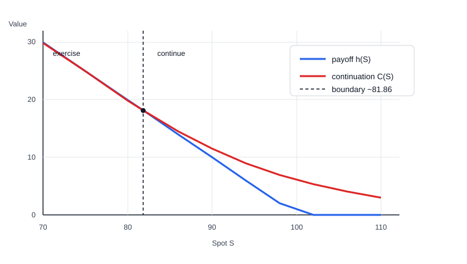

# American Option Dynamic Chebyshev Case Study

This technical blog asks a narrow but useful question: for a controlled
American option problem with a known transition law, can a Dynamic Chebyshev
solver reproduce a trusted quant-library price while evaluating much faster than
simulation or finite-difference re-pricing?

The answer in this case study is yes. The reason is not that Chebyshev
interpolation blindly learns the whole exercise policy. The useful split is:

```text
non-smooth part:  exercise decision, max(payoff, continuation)
smooth part:      continuation value under the known transition law
```

The example keeps the stopping decision explicit and applies Chebyshev
interpolation to the smoother continuation-value functions inside a
finite-horizon Bellman recursion. This is the same numerical-analysis idea used
in Dynamic Chebyshev methods for American-style products: isolate the
conditional expectation, approximate it accurately, then apply the exercise
rule outside the interpolant.

> **Scope of the "Dynamic Chebyshev" name.** The term follows Glau, Mahlstedt &
> Pötz (2019). This case study implements that *idea* — Chebyshev interpolation
> of the continuation value inside a backward Bellman recursion, with the `max`
> stopping rule applied exactly — but **not** their specific offline/online
> algorithm, in which a family of generalized moments
> $\mathbb{E}[T_k(S_{i+1}) \mid S_i = x_j]$ is precomputed once so the online
> recursion needs no fresh expectations. Here the conditional expectation is
> recomputed by Gauss-Hermite quadrature at every step (see the **Proposed
> Method** section below). It is "inspired by," not a reimplementation of, that
> paper.

The runnable harness lives in `examples/AmericanOptionDynamicChebyshev`.

```bash
dotnet run --project examples/AmericanOptionDynamicChebyshev/AmericanOptionDynamicChebyshev.csproj
```

For the general theory behind this study — Markov decision processes, value and policy
iteration, and how Chebyshev collocation compares to finite differences, regression, and
neural networks — see [From MDPs to Chebyshev Collocation](from-mdps-to-chebyshev-collocation.md).
For a shorter reusable recipe focused on the implementation pattern, see
[Continuous-State Dynamic Programming](continuous-state-dynamic-programming.md).

## Executive Result

The product is a one-year American put under the Black-Scholes-Merton model:

| Input | Value |
| --- | ---: |
| Spot | `100` |
| Strike | `100` |
| Risk-free rate | `5%` |
| Dividend yield | `0%` |
| Volatility | `20%` |
| Valuation date | `2026-05-15` |
| Maturity | `2027-05-15` |

One representative local run gives:

| Method | Price | Role |
| --- | ---: | --- |
| QLNet finite difference | `6.088238` | Numerical oracle |
| QLNet analytic European | `5.573526` | Lower control |
| Longstaff-Schwartz regression | `6.080847` | Simulation price baseline |
| Stanford-style LSPI | `5.745344` | RL price baseline |
| Dynamic Chebyshev | `6.083607` | Proposed price-and-Greeks solver |

Dynamic Chebyshev is within `0.004631` price points of the QLNet finite
difference oracle on the at-the-money request. After build, the reusable
Chebyshev model evaluates price, Delta, and Gamma in `7.339 us` in the local
benchmark, versus `33.780 ms` for the tutorial's QLNet reference path. That is
an online speedup of `4602.8x`. The QLNet timing includes the adapter's
bump-and-reprice Delta and Gamma path, not only a raw NPV call.

> **Benchmark scope.** These are single, representative local runs on the
> reference rig (12th Gen Intel Core i7-12700K, .NET 10 Release), not averaged
> benchmarks; absolute timings and the speedup are machine- and run-dependent.
> Prices and grid errors are deterministic and reproduce exactly. The QLNet
> reference path additionally prices a European option analytically on every
> call, which the Chebyshev online path does not, so the headline ratio
> overstates the like-for-like pricing gap somewhat. See
> [Performance](performance.md) for methodology.

## Numerical Oracle

The correctness oracle is QLNet, the C# port of QuantLib-style APIs. QuantLib
and QLNet support American vanilla options with numerical engines such as
finite differences and binomial trees. The case study uses the finite-difference
Black-Scholes engine as the reference and a Cox-Ross-Rubinstein tree as an
independent cross-check.

The reference construction is:

```text
AmericanOptionRequest
  -> QLNet PlainVanillaPayoff
  -> QLNet AmericanExercise(payoffAtExpiry: true)
  -> QLNet BlackScholesMertonProcess
  -> QLNet MakeFdBlackScholesVanillaEngine
       .withTGrid(300)
       .withXGrid(300)
       .withDampingSteps(0)
  -> NPV, bumped Delta, bumped Gamma
```

The market objects are intentionally simple: `Actual365Fixed`, `NullCalendar`,
flat risk-free and dividend curves, and `BlackConstantVol`. The cross-check tree
uses `BinomialVanillaEngine<CoxRossRubinstein>` with the same request. The
European lower control uses `AnalyticEuropeanEngine`.

The baseline is checked before any approximation is trusted:

1. An American put must be worth at least the European put.
2. A non-dividend American call should match the European call within numerical
   tolerance.
3. Finite-difference and high-step binomial prices must agree within a small
   band.
4. Put price must decrease as spot rises and increase as volatility rises.
5. Bumped Delta and Gamma must have sensible signs away from boundary
   pathologies.

These checks prevent the tutorial from benchmarking against a broken local
option pricer.

## The Stopping Problem

At exercise date $t_i$, the holder compares immediate exercise with
continuation. For a put with strike $K$,

$$
h(S_i)=\max(K-S_i,0).
$$

The finite-horizon dynamic program is

$$
C_i(S_i)
  =
  e^{-r\Delta t}
  \mathbb{E}\!\left[
    V_{i+1}(S_{i+1})\mid S_i
  \right],
$$

$$
V_i(S_i)=\max\left(h(S_i), C_i(S_i)\right),
\qquad
V_N(S_N)=h(S_N).
$$

The difficult object is the stopping rule near the exercise boundary. The
continuation value $C_i$ is usually smoother than the full value
$V_i=\max(h,C_i)$. Dynamic Chebyshev exploits that structure by approximating
the continuation function and leaving the `max` operation exact.

Under Black-Scholes-Merton dynamics,

$$
S_{i+1}
  =
  S_i
  \exp\left(
    (r-q-\tfrac{1}{2}\sigma^2)\Delta t
    + \sigma\sqrt{\Delta t}\,Z
  \right),
\qquad Z\sim N(0,1).
$$

Because this transition law is known, the conditional expectation can be
computed by quadrature instead of learned statistically from paths.

## Reporting Format

This page follows the style of a numerical study, not only an API walkthrough.
American-option simulation papers and the Kan thesis compare estimates against
trusted references before interpreting runtime. Chebyshev finance papers use a
similar discipline: compare against a benchmark pricing engine, test away from
interpolation nodes, and separate offline build cost from online evaluation.
The MoCaX/Ruiz-Zeron sensitivity papers also stress accuracy at risk-relevant
points, not only average price error.

For this tutorial, the clearest risk-review format is a case table. For each
spot case, report the QLNet ground truth, the Dynamic Chebyshev value, and the
relative difference for price, Delta, and Gamma.

| Field | Why it matters |
| --- | --- |
| Price estimate | Shows whether the method lands near the reference value. |
| QLNet sensitivity | Gives the finite-difference ground truth for the Greek. |
| Dynamic Chebyshev sensitivity | Shows what the reusable model returns online. |
| Relative difference | Makes errors comparable across price, Delta, and Gamma. |
| Runtime or build time | Shows whether the method is useful in a repeated risk loop. |
| Online evaluation time | Measures the reusable model after build. |

A single aggregate error number can hide where a method is accurate and where it
is weak. The 10-case tables below are therefore the main accuracy evidence for
the baselines and the Dynamic Chebyshev candidate.

## Related Work and Baselines

The two statistical baselines represent the simulation-based and
reinforcement-learning approaches commonly used for American exercise problems.
Both are legitimate methods. The point of this page is narrower: when the model
is known and the state is low-dimensional, deterministic Bellman collocation can
be cleaner, faster online, and less noisy.

Longstaff-Schwartz least-squares Monte Carlo estimates continuation by
regressing discounted future cashflows on basis functions of the current state.
It is simple and general, especially for path-dependent payoffs. The tradeoff is
that the estimate depends on path count, random seed, basis choice, and exercise
boundary quality. The Kan thesis uses this regression-Monte-Carlo family as a
starting point and then studies bias, variance reduction, and computing time.
The one-factor put used in this tutorial is not the same product as the thesis
tables, so this page includes a separate thesis-style max-call check under
Baseline Candidate 1.

Least-Squares Policy Iteration (LSPI), following the Stanford American-option
reinforcement-learning notes, treats exercise as an action-value problem. The
payoff for exercise is known exactly, while continuation is fitted from
simulated transitions. This is attractive when the policy must be learned from
samples, but it still inherits sampling error and feature sensitivity. Near the
exercise boundary, a small continuation error can change the action.

Dynamic Chebyshev follows the same Bellman recursion, but it uses deterministic
Chebyshev interpolation and quadrature for the continuation function. This is
most natural when the transition model is known and the state dimension is
controlled. It is not trying to learn the exercise payoff. It approximates the
smooth continuation object, then applies the stopping decision exactly.

## Baseline Candidate 1: Longstaff-Schwartz

### Method Role

This candidate answers the simulation question: if we use the standard
regression-Monte-Carlo idea, how close do we get before adding Chebyshev? It is
a legitimate baseline because it is model-flexible and widely used for
American-style products.

Longstaff-Schwartz simulates paths and works backward. At each exercise date,
only in-the-money paths are used for the regression. In this harness the
continuation basis is

$$
C_i(S_i)
\approx
\beta_{i,0}
+ \beta_{i,1}\frac{S_i}{K}
+ \beta_{i,2}\left(\frac{S_i}{K}\right)^2 .
$$

### Algorithm

Algorithm inputs: option request, path count $M$, and exercise-step count
$N$.

1. Simulate $M$ risk-neutral spot paths $S_{m,0},\ldots,S_{m,N}$.
2. At maturity, set each path's stored cashflow to $h(S_{m,N})$.
3. For each exercise step $i=N-1,\ldots,1$, work backward:
   - Keep only paths where immediate exercise has positive value,
     $h(S_{m,i})>0$.
   - Discount each selected path's currently stored future cashflow back to
     step $i$.
   - Regress those discounted cashflows on
     $1$, $S/K$, and $(S/K)^2$.
   - If $h(S_{m,i})$ is greater than the fitted continuation value, replace
     that path's stored cashflow with $h(S_{m,i})$ at step $i$.
4. Discount each realized cashflow to time 0.
5. Return the average present value.

### Price Baseline Result

The implemented baseline uses `12,000` paths, `50` exercise steps, and seed
`8675309`.

| Metric | Value |
| --- | ---: |
| QLNet FD price | `6.088238` |
| LSM price | `6.080847` |
| Absolute price difference | `0.007391` |
| Runtime for one estimate | `54.169 ms` |
| Exercised-path fraction | `39.10%` |

### Thesis Comparable Check

The one-factor put above is the tutorial problem. To verify that the LSM
implementation is also numerically comparable to the Kan thesis, the example
includes a separate Table 2.1-style benchmark:

```bash
dotnet run --project examples/AmericanOptionDynamicChebyshev/AmericanOptionDynamicChebyshev.csproj -- --thesis-benchmark
```

This benchmark uses the thesis Table 2.1 `n=2` Bermudan max-call setup:

| Setting | Value |
| --- | ---: |
| Asset count | `2` |
| Payoff | `max(max(S_1,S_2)-K,0)` |
| Initial spots | `90`, `100`, `110` |
| Strike | `100` |
| Risk-free rate | `5%` |
| Dividend yield | `10%` |
| Volatility | `20%` |
| Correlation | `0` |
| Maturity | `3` years |
| Exercise dates | `9` equally spaced dates |
| Paths | `200,000` |
| Regression basis | 10 polynomials in the highest and second-highest asset prices |

The thesis values are the `LS` column from Table 2.1. The ChebyshevSharp values
come from the local thesis benchmark mode.

| Assets | $S_0$ | Thesis LS | Thesis SE | ChebyshevSharp LS | Abs. diff. | Rel. diff. |
| ---: | ---: | ---: | ---: | ---: | ---: | ---: |
| `2` | `90` | `8.063` | `0.010` | `8.066` | `0.003` | `0.033%` |
| `2` | `100` | `13.861` | `0.012` | `13.860` | `0.001` | `0.004%` |
| `2` | `110` | `21.333` | `0.014` | `21.276` | `0.057` | `0.268%` |

This is the numerical comparability check. It is distinct from the main
one-factor American put case study, but it confirms that the local LSM
implementation agrees with the thesis benchmark at the same product settings to
within about `0.3%` in these three cases.

### 10-Case Price and Sensitivity Assessment

The LSM sensitivities below are finite-difference bump-and-reprice estimates
using the same fixed seed and `SpotBump = 0.5`. They are not analytic Greeks.

Price comparison:

| Spot | QLNet price | LSM price | Relative difference |
| ---: | ---: | ---: | ---: |
| `82.0` | `18.020345` | `17.965078` | `0.307%` |
| `86.0` | `14.480421` | `14.483739` | `0.023%` |
| `90.0` | `11.489487` | `11.460314` | `0.254%` |
| `94.0` | `8.998778` | `8.922124` | `0.852%` |
| `98.0` | `6.957290` | `6.938699` | `0.267%` |
| `102.0` | `5.311128` | `5.302969` | `0.154%` |
| `106.0` | `4.005139` | `3.991870` | `0.331%` |
| `110.0` | `2.985232` | `2.953272` | `1.071%` |
| `114.0` | `2.200635` | `2.182341` | `0.831%` |
| `118.0` | `1.605555` | `1.602980` | `0.160%` |

Sensitivity comparison:

| Spot | QLNet Delta | LSM Delta | Delta rel. diff. | QLNet Gamma | LSM Gamma | Gamma rel. diff. |
| ---: | ---: | ---: | ---: | ---: | ---: | ---: |
| `82.0` | `-0.957158` | `-0.950137` | `0.734%` | `0.033689` | `0.103618` | `207.577%` |
| `86.0` | `-0.814364` | `-0.788366` | `3.192%` | `0.034124` | `0.099890` | `192.724%` |
| `90.0` | `-0.683188` | `-0.706733` | `3.446%` | `0.031324` | `0.056333` | `79.842%` |
| `94.0` | `-0.564363` | `-0.537247` | `4.805%` | `0.028079` | `0.161166` | `473.965%` |
| `98.0` | `-0.458708` | `-0.449934` | `1.913%` | `0.024705` | `0.163590` | `562.171%` |
| `102.0` | `-0.366762` | `-0.364090` | `0.729%` | `0.021294` | `-0.029671` | `239.337%` |
| `106.0` | `-0.288568` | `-0.286664` | `0.660%` | `0.017889` | `-0.038363` | `314.449%` |
| `110.0` | `-0.223566` | `-0.224171` | `0.270%` | `0.014690` | `0.016238` | `10.536%` |
| `114.0` | `-0.170692` | `-0.180656` | `5.837%` | `0.011815` | `0.018202` | `54.060%` |
| `118.0` | `-0.128548` | `-0.131561` | `2.344%` | `0.009321` | `0.017037` | `82.791%` |

### Assessment

LSM gets a close price in this one run, which is why it is a useful baseline.
However, the case table shows why this plain implementation is not a good risk
clone. Delta is usable in some regions but inconsistent, and Gamma is unstable
because it is a second finite difference of a noisy regression estimate. A
production Monte Carlo Greek workflow would need extra machinery such as common
random numbers, path reuse, smoothing, or separate Greek estimators.

## Baseline Candidate 2: Stanford-Style LSPI

### Method Role

This candidate answers the reinforcement-learning question: if we learn an
exercise policy from simulated transitions, does that beat a direct numerical
Bellman solver on this controlled problem? The answer here is no. The
experiment is still useful because it shows why a known transition law should
not automatically be treated as a model-free learning problem.

The RL baseline uses a linear continuation action value. Exercise is not
learned; it is the known payoff:

$$
Q(s,\mathrm{exercise})=h(s).
$$

Continuation is represented as

$$
Q(s,\mathrm{continue})\approx w^\top\phi(s),
$$

where $\phi(s)$ contains Laguerre-style functions of $S/K$ plus simple
time-to-maturity features. The policy is

$$
\pi(s)=
\begin{cases}
\mathrm{continue}, & w^\top\phi(s)\ge h(s),\\
\mathrm{exercise}, & \text{otherwise}.
\end{cases}
$$

### Algorithm

Algorithm inputs: option request, path count $M$, exercise-step count $N$,
and maximum policy-iteration count $L$.

1. Simulate $M$ risk-neutral training paths.
2. Initialize the continuation weights with $w=0$.
3. For each policy iteration $1,\ldots,L$:
   - For every transition $(S_i,S_{i+1})$ on the training paths, compute the
     feature vector $\phi(S_i,i)$.
   - Under the current policy, decide whether the next state $S_{i+1}$
     continues or exercises.
   - Add the transition to the linear policy-evaluation system.
   - Solve the regularized linear system for updated weights.
   - Stop if the weights no longer change materially.
4. Simulate independent evaluation paths.
5. Apply the learned policy: exercise when
   $h(S_i)>w^\top\phi(S_i,i)$; otherwise continue.
6. Return the discounted payoff average.

### Price Baseline Result

The implemented baseline uses `12,000` paths, `50` exercise steps, seed `13579`,
and up to `12` policy iterations.

| Metric | Value |
| --- | ---: |
| QLNet FD price | `6.088238` |
| LSPI price | `5.745344` |
| Absolute price difference | `0.342894` |
| Runtime for one train/evaluate run | `2147.811 ms` |
| Policy iterations used | `10` |
| Feature count | `7` |
| Boundary exercise decisions | `3585` |

### 10-Case Price and Sensitivity Assessment

The LSPI sensitivities are also finite-difference bump-and-reprice estimates
using the same fixed seed and `SpotBump = 0.5`.

Price comparison:

| Spot | QLNet price | LSPI price | Relative difference |
| ---: | ---: | ---: | ---: |
| `82.0` | `18.020345` | `17.866411` | `0.854%` |
| `86.0` | `14.480421` | `14.261597` | `1.511%` |
| `90.0` | `11.489487` | `10.441624` | `9.120%` |
| `94.0` | `8.998778` | `8.332084` | `7.409%` |
| `98.0` | `6.957290` | `6.530878` | `6.129%` |
| `102.0` | `5.311128` | `5.050101` | `4.915%` |
| `106.0` | `4.005139` | `3.837158` | `4.194%` |
| `110.0` | `2.985232` | `2.886170` | `3.318%` |
| `114.0` | `2.200635` | `2.147930` | `2.395%` |
| `118.0` | `1.605555` | `1.598846` | `0.418%` |

Sensitivity comparison:

| Spot | QLNet Delta | LSPI Delta | Delta rel. diff. | QLNet Gamma | LSPI Gamma | Gamma rel. diff. |
| ---: | ---: | ---: | ---: | ---: | ---: | ---: |
| `82.0` | `-0.957158` | `-0.970962` | `1.442%` | `0.033689` | `-0.082932` | `346.172%` |
| `86.0` | `-0.814364` | `-0.895293` | `9.938%` | `0.034124` | `0.161613` | `373.598%` |
| `90.0` | `-0.683188` | `-0.752912` | `10.206%` | `0.031324` | `0.770025` | `2,358.283%` |
| `94.0` | `-0.564363` | `-0.491628` | `12.888%` | `0.028079` | `-0.032893` | `217.145%` |
| `98.0` | `-0.458708` | `-0.406196` | `11.448%` | `0.024705` | `-0.023766` | `196.198%` |
| `102.0` | `-0.366762` | `-0.338874` | `7.604%` | `0.021294` | `0.035751` | `67.889%` |
| `106.0` | `-0.288568` | `-0.260818` | `9.617%` | `0.017889` | `-0.020637` | `215.357%` |
| `110.0` | `-0.223566` | `-0.218171` | `2.413%` | `0.014690` | `-0.003586` | `124.411%` |
| `114.0` | `-0.170692` | `-0.166944` | `2.196%` | `0.011815` | `0.042181` | `257.019%` |
| `118.0` | `-0.128548` | `-0.129953` | `1.093%` | `0.009321` | `-0.012735` | `236.635%` |

### Assessment

The LSPI result is materially below the QLNet finite-difference oracle. The
fitted continuation/action boundary is not accurate enough near the exercise
region, so the policy gives up too much exercise value. The case table also
shows that the sensitivity profile is not acceptable for this risk-use case:
Delta is often off by several percent, and Gamma is frequently wrong by more
than `100%`.

This is an important negative result. RL-style policy learning is valuable when
the transition law is unknown, when data arrives from an environment, or when a
large state/action space makes deterministic collocation impossible. In this
one-factor Black-Scholes-Merton benchmark, the transition law is known and the
continuation expectation can be computed directly. Learning the policy adds
variance and feature risk without solving a harder information problem.

## Continuous-State Dynamic Programming Context

This case study is a continuous-state, finite-horizon dynamic program. The general theory —
Markov decision processes, the Bellman equation, contraction and value/policy iteration, why a
continuous state cannot be tabulated, and how Chebyshev collocation compares to regression, neural
networks, and finite differences — is developed in
[From MDPs to Chebyshev Collocation](from-mdps-to-chebyshev-collocation.md). This section states only
what is specific to the American-option problem solved here.

The reframing that makes the method work is that **the transition law is known**. Under one-factor
Black-Scholes the conditional distribution of $S_{i+1}$ given $S_i=S$ is available in closed form, so
the continuation value

$$
C_i(S)=e^{-r\Delta t}\,\mathbb{E}\!\left[V_{i+1}(S_{i+1})\mid S_i=S\right]
$$

is a *computable* operator, not an object that must be inferred from realised cashflows.
Longstaff-Schwartz and LSPI estimate it from sampled paths because they treat the model as unknown;
here it is evaluated directly by quadrature. The data are not the teacher — the Bellman equation is.

This is the smooth/non-smooth split the whole design rests on. The continuation value $C_i$ is smooth
and is the single object approximated by a Chebyshev interpolant; the exercise decision is the exact,
non-smooth comparison

$$
V_i(S)=\max\bigl(h(S),C_i(S)\bigr),\qquad
\pi_i(S)=
\begin{cases}
\text{exercise}, & h(S)\ge C_i(S),\\
\text{continue}, & C_i(S)>h(S).
\end{cases}
$$

Because the action set is the two-element $\{\text{exercise},\text{continue}\}$, the policy is a direct
comparison of two known numbers — no continuous-action optimiser and no reinforcement-learning
exploration are required. Maturity supplies the terminal condition $V_N(S)=h(S)$, so the solver walks
backward through the exercise dates; it does **not** use the infinite-horizon fixed point $V=T[V]$ or
any policy-iteration convergence loop. (The primer explains why finite-horizon backward induction is
value iteration that simply terminates after $N$ sweeps.)

`ContinuousDPs.jl` is cited as a conceptual reference for this model-based, collocation view of dynamic
programming, not as an American-option pricing engine; its generic solver performs a per-node
continuous-action maximisation that this two-action stopping problem does not need. The
**What Was Parity Checked** section below states exactly what is and is not validated against it.

The concrete collocation step — building the continuation interpolant through model-computed targets at
the Chebyshev spot nodes, and the Gauss-Hermite quadrature that produces those targets — is given in the
**Proposed Method: Dynamic Chebyshev** section below.

### Glossary

| Term | Meaning in this page |
| --- | --- |
| Value function $V_i(S)$ | The option value at exercise date $i$ and spot $S$, after making the best exercise/continue decision. |
| Payoff $h(S)$ | The immediate exercise value. For the put, $h(S)=\max(K-S,0)$. |
| Continuation value $C_i(S)$ | The discounted expected value of not exercising today and behaving optimally later. |
| Bellman operator $T[\cdot]$ | The rule that maps a next-step value function into today's continuation value by transition, expectation, and discounting. |
| Collocation node | A representative state point where the approximation is required to match the Bellman update. |
| Exercise boundary | The spot where payoff and continuation are equal. On one side exercise is optimal; on the other side continuation is optimal. |

### Boundary Picture

Run:

```bash
dotnet run --project examples/AmericanOptionDynamicChebyshev/AmericanOptionDynamicChebyshev.csproj -- --boundary-diagnostics
```

The first-step decision compares payoff $h(S)$ and continuation $C(S)$. The
boundary is where the two curves cross:



Representative values from the diagnostics mode:

| Spot | Payoff $h(S)$ | Continuation $C(S)$ | Decision | $C(S)-h(S)$ |
| ---: | ---: | ---: | --- | ---: |
| `70.0` | `30.000000` | `29.935791` | exercise | `-0.064209` |
| `75.0` | `25.000000` | `24.940874` | exercise | `-0.059126` |
| `80.0` | `20.000000` | `19.942732` | exercise | `-0.057268` |
| `82.0` | `18.000000` | `18.006888` | continue | `0.006888` |
| `90.0` | `10.000000` | `11.479677` | continue | `1.479677` |
| `100.0` | `0.000000` | near `6.083607` | continue | positive |

The estimated first-step boundary in this run is around spot `81.86`. This is
also why small continuation errors near the boundary matter: the value itself
may be close, but the exercise/continue decision can flip when $h(S)$ and
$C(S)$ are nearly equal.

### Why the boundary kink costs accuracy

The boundary is a *kink*, and that is what bounds the method's accuracy. Smooth
pasting makes the value $C^1$ across $B_i$ (the slopes match), but the second
derivative $V_{SS}$ jumps there -- zero in the exercise region, positive in the
continuation region. A jump in the second derivative is a $\nu = 2$ singularity,
so a global Chebyshev interpolant over the whole spot domain converges only
**algebraically, $O(n^{-2})$**, near the boundary instead of geometrically (see
[Kinks vs jumps](concepts.md#kinks-vs-jumps-how-fast-the-rate-degrades)).

The current solver interpolates the continuation with a *single* 81-node
`ChebyshevApproximation` over `[5, 250]` and places **no knot at the boundary**,
so each step's continuation carries this mild non-smoothness across $B_i$. The
value error stays small -- payoff and continuation nearly coincide *at* the
boundary, so a misplaced corner barely moves the price -- but the damage
concentrates in the **second derivative**. That is exactly why the worst metric
in the study is Gamma at spot `82.0` (the row next to the $\approx 81.86$
boundary): `23.7%` relative, while price and Delta stay accurate.

The principled remedy is to **split at the boundary**: locate $B_i$ each step by
root-finding the payoff $=$ continuation crossing and represent the continuation
as a two-piece [`ChebyshevSpline`](spline.md) with the knot at $B_i$, so each
piece is smooth and spectral accuracy (and clean Greeks) return. The trade-off
is that $B_i$ moves every step, so the two boundary-straddling pieces relocate --
the method tolerates the kink today precisely to keep the per-step work cheap and
reusable.

### Bellman Diagnostics

The current example does not expose a full residual curve for every backward
step. It does include the checks below, which are the minimum diagnostics needed
to trust the implemented Bellman layer before comparing prices:

| Check | Result | Purpose |
| --- | ---: | --- |
| Transition first-moment residual | `< 1e-12` in unit test | Verifies the risk-neutral transition and discounting used by the expectation operator. |
| Max spot-grid price abs. error vs QLNet FD | `1.346E-002` | Checks the solved value against the numerical oracle away from only one point. |
| Max spot-grid Delta abs. error vs QLNet FD | `1.112E-002` | Checks first sensitivity from the reusable model. |
| Max spot-grid Gamma abs. error vs QLNet FD | `7.993E-003` | Checks second sensitivity, which is the most fragile metric here. |
| Estimated first-step boundary | `81.86` spot | Confirms the payoff/continuation switch is visible and inspectable. |

A stronger future diagnostic would store each time-step continuation interpolant
and report a Bellman residual curve on dense validation nodes. That would make
the page even closer to a numerical-analysis paper.

## Proposed Method: Dynamic Chebyshev

### Method Role

This candidate answers the numerical-analysis question: if the model is known,
can we approximate the continuation value deterministically and keep the
exercise decision exact? This is the method the page is trying to motivate. It
does not estimate continuation from realized paths. It builds continuation
functions on Chebyshev nodes and reuses them for online price and Greeks.

Dynamic Chebyshev keeps the same Bellman equation but replaces pathwise
continuation estimation with deterministic interpolation and quadrature. At time
step $i$, build a one-dimensional Chebyshev approximation of
$\widehat{C}_i(S)$ on a bounded spot domain:

$$
\widehat{C}_i(S)
\approx
e^{-r\Delta t}
\mathbb{E}\!\left[
  \max\left(h(S_{i+1}),\widehat{C}_{i+1}(S_{i+1})\right)
  \mid S_i=S
\right].
$$

The expectation is evaluated with 8-point Gauss-Hermite quadrature. With nodes
$x_m$ and weights $w_m$,

$$
\widehat{C}_i(S)
 =
e^{-r\Delta t}
\frac{1}{\sqrt{\pi}}
\sum_m
w_m
\widehat{V}_{i+1}
\left(
S\exp\left(
  (r-q-\tfrac{1}{2}\sigma^2)\Delta t
  + \sqrt{2}\sigma\sqrt{\Delta t}\,x_m
\right)
\right).
$$

The exercise value remains exact:

$$
\widehat{V}_i(S)
 =
\max\left(h(S),\widehat{C}_i(S)\right).
$$

### Algorithm

Algorithm inputs: option request, spot domain $[S_{\min},S_{\max}]$,
exercise-step count $N$, Chebyshev node count $n$, and quadrature node count
$q$.

1. Set the terminal value to $V_N(S)=h(S)$.
2. For each exercise step $i=N-1,\ldots,0$, work backward:
   - For each Chebyshev spot node $S_j\in[S_{\min},S_{\max}]$, map each
     Gauss-Hermite node into a next spot $S_{\mathrm{next}}$.
   - Evaluate $V_{i+1}(S_{\mathrm{next}})$.
   - Discount and average the quadrature values to get $C_i(S_j)$.
   - Build a Chebyshev interpolant for $C_i(S)$.
   - Define the stopping value as $V_i(S)=\max(h(S),C_i(S))$.
3. Store the first-step continuation interpolant.
4. For online evaluation at spot $S$:
   - Evaluate continuation, Delta, and Gamma from the interpolant.
   - Compare continuation with exact payoff.
   - Return price, Delta, and Gamma from the active branch.

### Local Result

The implemented settings are `80` exercise steps, `81` spot nodes on
`[5, 250]`, and quadrature order `8`. The build uses `6,480` source evaluations
and takes `0.068s` in the representative run.

| Metric | Value |
| --- | ---: |
| Price | `6.083607` |
| Absolute error versus QLNet FD | `0.004631` |
| Standard error | deterministic |
| Build evaluations | `6,480` |
| Build time | `0.068s` |
| Online price/Delta/Gamma evaluation | `7.339 us` |
| QLNet reference price/Delta/Gamma path | `33.780 ms` |
| Online speedup after build | `4602.8x` |
| Spot-grid max price absolute error | `1.346E-002` |
| Spot-grid max Delta absolute error | `1.112E-002` |
| Spot-grid max Gamma absolute error | `7.993E-003` |

### 10-Case Price and Sensitivity Assessment

The case-level assessment is the main risk check. It compares QLNet finite
difference ground truth against the reusable Dynamic Chebyshev model at 10 spot
levels. Run it with:

```bash
dotnet run --project examples/AmericanOptionDynamicChebyshev/AmericanOptionDynamicChebyshev.csproj -- --case-assessment
```

The relative difference is

$$
\frac{|\text{Dynamic Chebyshev} - \text{QLNet}|}
     {\max(|\text{QLNet}|,10^{-12})}.
$$

Price comparison:

| Spot | QLNet price | Dynamic Chebyshev price | Relative difference |
| ---: | ---: | ---: | ---: |
| `82.0` | `18.020345` | `18.006888` | `0.075%` |
| `86.0` | `14.480421` | `14.469788` | `0.073%` |
| `90.0` | `11.489487` | `11.479677` | `0.085%` |
| `94.0` | `8.998778` | `8.991689` | `0.079%` |
| `98.0` | `6.957290` | `6.951734` | `0.080%` |
| `102.0` | `5.311128` | `5.307288` | `0.072%` |
| `106.0` | `4.005139` | `4.002684` | `0.061%` |
| `110.0` | `2.985232` | `2.983804` | `0.048%` |
| `114.0` | `2.200635` | `2.200245` | `0.018%` |
| `118.0` | `1.605555` | `1.605885` | `0.021%` |

Sensitivity comparison:

| Spot | QLNet Delta | Dynamic Chebyshev Delta | Delta rel. diff. | QLNet Gamma | Dynamic Chebyshev Gamma | Gamma rel. diff. |
| ---: | ---: | ---: | ---: | ---: | ---: | ---: |
| `82.0` | `-0.957158` | `-0.946034` | `1.162%` | `0.033689` | `0.025696` | `23.725%` |
| `86.0` | `-0.814364` | `-0.816096` | `0.213%` | `0.034124` | `0.035406` | `3.755%` |
| `90.0` | `-0.683188` | `-0.681991` | `0.175%` | `0.031324` | `0.031182` | `0.454%` |
| `94.0` | `-0.564363` | `-0.564028` | `0.059%` | `0.028079` | `0.028053` | `0.093%` |
| `98.0` | `-0.458708` | `-0.458187` | `0.113%` | `0.024705` | `0.024722` | `0.068%` |
| `102.0` | `-0.366762` | `-0.366355` | `0.111%` | `0.021294` | `0.021238` | `0.263%` |
| `106.0` | `-0.288568` | `-0.288224` | `0.119%` | `0.017889` | `0.017832` | `0.322%` |
| `110.0` | `-0.223566` | `-0.223307` | `0.116%` | `0.014690` | `0.014691` | `0.006%` |
| `114.0` | `-0.170692` | `-0.170412` | `0.164%` | `0.011815` | `0.011787` | `0.234%` |
| `118.0` | `-0.128548` | `-0.128417` | `0.102%` | `0.009321` | `0.009311` | `0.097%` |

The price and Delta differences are small across all 10 cases. The largest
relative Gamma difference occurs at spot `82.0`; in absolute terms the
difference is about `0.007993`, which is the same gamma error reported by the
fixed grid validation. That row is worth keeping because it shows where the
current model is weakest.

### Assessment

This is the strongest candidate in the controlled benchmark. It has the smallest
at-the-money error among the three non-oracle methods, no Monte Carlo standard
error, and a reusable online object. The build cost is paid once. After that,
the same stored continuation functions return price, Delta, and Gamma without
running a new finite-difference solve or a new simulation.

The 10-case table is more important than the at-the-money number. It shows the
approximation is not just tuned to spot `100`; it remains close to the QLNet
oracle across a small risk-relevant spot range and reports Greeks directly from
the stored continuation interpolants.

The limitation is equally important: this is not a universal replacement for
all American-style products. It is best suited when the transition law is known,
the state dimension is controlled, and the continuation function is smooth
enough on a bounded domain. In that setting, Dynamic Chebyshev attacks the
right object: the conditional expectation. It leaves the non-smooth stopping
decision as an exact comparison.

The reusable model is small at the call site:

```csharp
var settings = new DynamicChebyshevSettings(
    ExerciseSteps: 80,
    SpotNodeCount: 81,
    SpotLower: 5.0,
    SpotUpper: 250.0,
    QuadratureOrder: 8);

var model = new DynamicChebyshevAmericanOptionPricer().Build(request, settings);
var valueAndGreeks = model.Evaluate(100.0);
```

`Build` performs the backward induction. `Evaluate` reuses the first-step
continuation interpolant to return price, Delta, and Gamma at new spot values.

### Why the boundary Gamma is weak, and why splitting there does not help

The one weak row above is spot `82.0`, just inside the continuation region
(`B0` is about `81.86`). Its Gamma is off by `23.7%` while every other Greek on
the grid is within a fraction of a percent. This is structural, not a bug. By
the *smooth-pasting* condition the American value `V` is `C^1` across the
exercise boundary (value and Delta continuous) but its **second** derivative
jumps, so Gamma is the fragile quantity exactly there. The model reads Gamma
from the stored continuation `C`, whose curvature just above the boundary does
not fully match the true `V_SS` on this grid.

The natural idea, placing a `ChebyshevSpline` knot at `B0` so each piece is
smooth, was implemented and **measured, and it does not help**: near the
boundary it makes Gamma *worse*. The reason is precise. The solver interpolates
the **continuation** `C`, applying `max(payoff, C)` exactly *outside* the
interpolant. `C` is a Gaussian (Gauss-Hermite) expectation of the next step, so
it is smooth: `C''` is monotone right through `B0`, and the kink lives only in
the *price* `max(payoff, C)`, which is already handled exactly. Splitting a
smooth `C` at `B0` resolves no singularity; it only relocates the spot-`82`
Gamma query onto the **clustered edge of the upper piece**, where a Chebyshev
second-derivative differentiation matrix is most ill-conditioned (a measured
~4000x edge amplification versus the interior). The split even produced a
non-physical *negative* Gamma one tick above the knot. Raising the node count
makes both variants worse, because the wide-spot Gauss-Hermite quadrature loses
finite values at high `n`.

What *does* help, cheaply, is seeding the terminal backward step with the exact
one-period European Black-Scholes value (the `ClosedFormTerminalStep` option)
instead of quadrature against the kinked payoff. It lowers the near-money price
error (at-the-money `0.004631` to `0.003490`) by removing the strike-corner
quadrature distortion at the worst-fitted step. It does not change the boundary
Gamma, which is a different effect.

The correct structural cure for boundary-aware spectral Greeks is a
**front-fixing (Landau) transform** that maps the moving boundary `B(t)` to a
fixed grid line, so the smooth region is resolved without an interpolation
endpoint sitting on the query (Company, Egorova & Jodar 2014). That is a solver
re-architecture rather than a knot tweak, and is the direction for a future
boundary-aware variant.

## Accuracy and Speed

The aggregate comparison is useful only after reading the per-candidate
assessments above:

| Method | Price | Abs. error vs QLNet FD | Local time profile |
| --- | ---: | ---: | --- |
| QLNet finite difference | `6.088238` | n/a | `33.780 ms` reference price/Delta/Gamma path |
| Longstaff-Schwartz | `6.080847` | `0.007391` | `54.169 ms` one price estimate |
| Stanford-style LSPI | `5.745344` | `0.342894` | `2147.811 ms` train/evaluate run |
| Dynamic Chebyshev | `6.083607` | `0.004631` | `0.068s` build, then `7.339 us` online |

The detailed 10-case table above is the risk evidence. The summary here only
shows the at-the-money price and representative timing.

The spot-grid validation compares Dynamic Chebyshev against QLNet finite
difference results for spots from `80` to `120`:

| Metric | Value |
| --- | ---: |
| Max price absolute error | `1.346E-002` |
| Max Delta absolute error | `1.112E-002` |
| Max Gamma absolute error | `7.993E-003` |
| Dynamic Chebyshev Delta at spot 100 | `-0.410533` |
| Dynamic Chebyshev Gamma at spot 100 | `0.022946` |
| Online Dynamic Chebyshev evaluation | `7.339 us` |
| QLNet reference evaluation | `33.780 ms` |
| Online speedup | `4602.8x` |

This comparison is intentionally online. The model pays a build cost once, then
reuses the interpolants for repeated prices and bumped-risk requests. That is
the natural setting for a risk loop, calibration diagnostic, or scenario grid.

## What Was Parity Checked

The American-option numerical oracle is QLNet, not the Chebyshev model itself.
The finite-difference engine supplies the reference price and bumped Greeks; the
high-step Cox-Ross-Rubinstein tree provides an independent numerical
cross-check.

As described above, `ContinuousDPs.jl` is used as a conceptual and parity-style
reference for continuous-state Bellman collocation, not as the price oracle. It
solves continuous-state dynamic programs, but not this exact finite-horizon
American option. The case study therefore does not claim direct American-option
price parity against `ContinuousDPs.jl`.

The parity check targets the shared mathematical layer: transition, discounting,
and Bellman expectation. The test suite checks the risk-neutral first-moment
identity used inside the Dynamic Chebyshev continuation builder:

$$
e^{-r\Delta t}\mathbb{E}[S_{i+1}\mid S_i=S]
  =
S e^{-q\Delta t}.
$$

That verifies the transition-and-discount step shared by Bellman-collocation
methods before the American-option-specific stopping rule is applied.

## Interpretation

The methods spend effort in different places:

| Method | What it estimates | Main limitation in this case study |
| --- | --- | --- |
| QLNet finite difference | PDE/grid reference value | Accurate but expensive for repeated tutorial risk loops |
| Longstaff-Schwartz | Continuation by pathwise regression | Sampling noise and basis sensitivity |
| LSPI | Continuation action value and policy | Sampling noise, feature sensitivity, unstable boundary fit |
| Dynamic Chebyshev | Continuation by collocation and quadrature | Requires known transition law and controlled state dimension |

The result is not a claim that reinforcement learning is generally inferior.
RL is useful when the transition law is unknown, the state/action space is too
large for direct gridding, or the policy must be learned from experience. Here
the transition model is known, the state is one-dimensional, and the payoff is
explicit. In that setting, deterministic continuation-value approximation is
the cleaner tool.

## Reproduce the Case Study

Run the example:

```bash
dotnet run --project examples/AmericanOptionDynamicChebyshev/AmericanOptionDynamicChebyshev.csproj
```

The output reports the QLNet finite-difference oracle, European control,
Longstaff-Schwartz baseline, Stanford-style LSPI baseline, Dynamic Chebyshev
price, Delta, Gamma, build cost, online speed, and spot-grid errors.

Run the case-level price and sensitivity comparison:

```bash
dotnet run --project examples/AmericanOptionDynamicChebyshev/AmericanOptionDynamicChebyshev.csproj -- --case-assessment
```

Run the thesis Table 2.1-style LSM comparison:

```bash
dotnet run --project examples/AmericanOptionDynamicChebyshev/AmericanOptionDynamicChebyshev.csproj -- --thesis-benchmark
```

Use this workflow for future optimal-stopping experiments:

1. Start with a trusted quant-library oracle.
2. Write economic sanity tests before approximation tests.
3. Reproduce standard statistical baselines, not local inventions.
4. Separate the smooth continuation value from the stopping rule.
5. Approximate continuation with Chebyshev interpolation.
6. Reuse the built model for price and Greeks.
7. Report case-level price and sensitivity errors, not only aggregate errors.
8. Report build cost, online speed, and limitations together.

## Sources

Core references are listed in [Citations](citations.md), especially the
American-option, reinforcement-learning, dynamic-programming, QLNet, QuantLib,
QuantEcon, and Dynamic Chebyshev entries.
