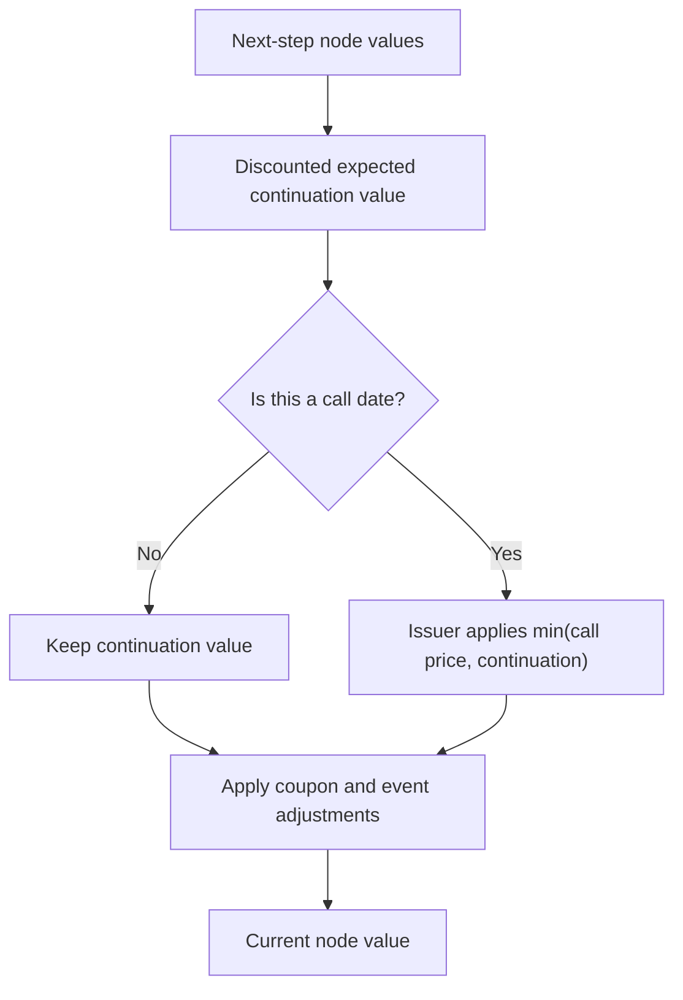
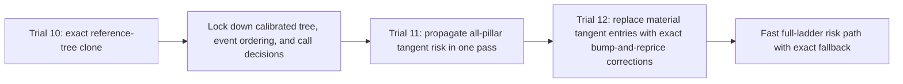

# Callable Bond Surrogate Case Study

This technical blog asks a practical question: can a Chebyshev-style surrogate
replace a callable fixed-rate bond pricer while preserving both price and
risk-manager sensitivities?

The short answer is: not by blindly fitting one global high-dimensional tensor.
For fast present-value approximation alone, callable bonds are already a
documented Chebyshev use case. The harder target in this article is a
request-level clone: keep the full 65-dimensional input, reproduce the
reference engine's exercise behavior, and compute the full 60-pillar DV01
ladder with useful speedup.

The first practical candidate is not a black-box tensor. It reproduces the
reference callable-bond tree semantics first, then accelerates risk by combining
a one-pass tangent DV01 ladder with exact bump-and-reprice corrections for the
material pillars. This materiality gate is a speed optimization, not the source
of correctness: the exact all-pillar cloned-tree DV01 is the faithful baseline.
The investigation has one thread: try the obvious Chebyshev models, show why
they fail, then stop treating the pricer as a black box. The final direction is
structure-aware acceleration: preserve the non-smooth call-decision engine and
speed up the smooth or repetitive risk work around it.

The example is public and reproducible. It uses QLNet as the reference
implementation, a pinned Federal Reserve nominal-yield-curve fixture, a
semiannual fixed-rate bullet bond, and a one-factor Hull-White tree callable
bond engine. It is a ChebyshevSharp demonstration, not a general fixed-income
engine.

## What the example prices

A plain cashflow-discounting product is often cheap once its schedule is
cached. A callable bond adds an embedded issuer option. The standard pricing
picture is:

$$
Q_{\mathrm{callable}}
  =
  Q_{\mathrm{straight}}
  -
  V_{\mathrm{issuer\ call}} .
$$

The straight-bond leg is mostly deterministic cashflow discounting. The issuer
call option is harder because the optimal call decision depends on the future
rate tree and the call schedule. That makes this example closer to the risk
workloads where Chebyshev tensors are useful: the baseline call is expensive,
and users need repeated PV and sensitivity evaluations across many scenarios.

The harness prices a deliberately restricted regular callable fixed-rate bond
family:

| Item | Choice |
| --- | --- |
| Reference pricer | QLNet `CallableFixedRateBond` with `TreeCallableFixedRateBondEngine` |
| Short-rate model | One-factor Hull-White, mean reversion fixed at 3% |
| Curve fixture | Federal Reserve fitted nominal yield curve, 2026-05-15 |
| Curve grid | valuation-date anchor plus 60 semiannual zero-rate pillars |
| Curve convention | Actual/365 Fixed timing, continuous compounding, linear zero-rate interpolation |
| Bond family | regular callable fixed-rate bullet bond |
| Coupon schedule | semiannual |
| Coupon day count | 30/360 USA |
| Calendar | U.S. Government Bond |
| Business-day rule | Modified Following |
| Settlement assumption | valuation date equals settlement/effective date |
| Supported calls | first-call and maturity dates aligned to the semiannual coupon grid, then semiannual calls |
| Excluded features | stubs, arbitrary settlement dates, non-aligned calls, accrued-settlement effects, amortization, exotic callability rules |

This is the same broad motivation as the Chebyshev-tensor finance literature:
use structured approximation to amortize expensive repeated pricing and
sensitivity calculations. It also connects to the dynamic Chebyshev literature
for American and Bermudan options: early-exercise products should be treated
through their continuation-value recursion, not only as one final black-box
payoff surface.

The extra work in this page comes from putting that literature into a
request-level fixed-income clone. Many examples of approximation in finance can
be useful after validating price accuracy, low-dimensional factors, or model
Greeks. This study uses a more demanding acceptance rule: the clone must also
preserve arbitrary local key-rate bumps, full-ladder DV01, mixed sensitivities,
engine event ordering, and fallback boundaries.

The concrete baseline and event ordering come from the QLNet/QuantLib
callable-bond engine; see [Citations](citations.md) for the source links and
papers.

For fast PV approximation, the callable-bond-specific precedent is Glau, Pötz,
Soloveitchik, and Wunderlich's *Efficient Valuation of Callable Bonds: The
Dynamic Chebyshev Method*, which applies dynamic Chebyshev interpolation to
callable-bond pricing. The surrounding literature also covers Chebyshev
interpolation for parametric option pricing, low-rank tensor formats, American
and Bermudan dynamic Chebyshev methods, and MoCaX-style risk acceleration.
This page asks for a stricter risk clone on top of that price-surface story.

## The clone target

Every trial uses the same full-dimensional request-level wrapper:

```text
curveBumps[60], coupon, maturity, firstCall, callPrice, sigma
    -> callable dirty price per 100 notional
```

The public dimension count is 65. The 60 curve coordinates are basis-point
bumps to semiannual zero-rate pillars from 0.5Y to 30Y. The remaining
coordinates are the coupon rate, maturity in years, first-call time in years,
clean call price, and Hull-White volatility. Hull-White mean reversion is fixed
at 3% in the first harness.

Internally, a model may compress the curve or decompose the formula. The public
input contract still stays 65D so that a caller can treat the surrogate as a
request-level clone. The documentation labels each internal model honestly:

| Label | Meaning |
| --- | --- |
| Faithful full-pillar clone | Accepts arbitrary 60-pillar bump vectors without changing the risk contract. |
| Factor-risk surrogate | Projects the 60-pillar curve into a smaller factor basis, so it is only faithful for factor-like scenarios. |
| Formula-aware surrogate | Uses bond structure outside Chebyshev, then approximates only the remaining expensive component. |

## The reference engine

The reference pricer is QLNet:

```text
CallableBondRequest
  -> QLNet Schedule
  -> QLNet CallableFixedRateBond
  -> QLNet InterpolatedZeroCurve<Linear>
  -> QLNet HullWhite
  -> QLNet TreeCallableFixedRateBondEngine
  -> CallableBondResult
```

Run the baseline:

```bash
dotnet run --project examples/CallableBondSurrogate/CallableBondSurrogate.csproj
```

The default scenario is a 30Y, 6% coupon callable bond with first call at 5Y,
call price 100, Hull-White mean reversion 3%, volatility 1%, and 80 tree steps.
The zero curve is the pinned semiannual Federal Reserve fixture documented for
this repository's public finance examples.

The harness checks economic sanity before fitting surrogates: the callable
dirty price should not exceed the comparable straight-bond dirty price, upward
curve bumps should reduce price, post-maturity direct curve exposure should be
negligible, tree-step convergence should be stable, and call price / volatility
effects should have the expected sign.

## The baseline recursion

The reason this product is harder than a straight bond is not the coupon
schedule by itself. The hard part is the issuer's exercise choice. At a coupon
date with no call, the lattice rolls the next value backward:

$$
V_{i,j}
 =
 D_{i,j}
 \sum_b p_{i,j,b} V_{i+1,d(i,j,b)} .
$$

Here \(i\) is the time step, \(j\) is the short-rate tree node,
\(p_{i,j,b}\) are transition probabilities, \(d(i,j,b)\) maps each branch to a
node at the next time step, and \(D_{i,j}\) is the one-step discount factor.
Schematically, at a call date the issuer can redeem at call price \(K\). If
\(\mathcal{C}_{i,j}\) is the rolled-back continuation value,

$$
\mathcal{C}_{i,j}
 =
D_{i,j}
\sum_b p_{i,j,b}V_{i+1,d(i,j,b)},
\qquad
V_{i,j}=\min(K,\mathcal{C}_{i,j})
\quad \text{before coupon-date adjustments.}
$$

The actual engine also applies coupon adjustments at event dates; in the simple
post-coupon case this becomes
\(V_{i,j}=\min(K,\mathcal{C}_{i,j})+\mathrm{coupon}_i\). QLNet has additional
ordering rules when a call date is snapped to a nearby coupon date, which is
why later trials reproduce the reference event ordering explicitly.

The node-level decision flow is:



This `min` is the central difficulty. A small curve bump can change which side
of the exercise boundary a node belongs to. A price surface can look accurate
while the finite bump-and-reprice DV01 ladder is wrong, because the bumped
reference engine may make a different call decision.

## How price and risk are checked

PV alone is not enough for a risk surrogate. The case study also checks first
and mixed finite-difference quantities:

| Metric | Meaning |
| --- | --- |
| PV | Dirty price per 100 notional. |
| Zero-pillar DV01 | Sensitivity to one zero-rate pillar bump. |
| Coupon derivative | Slope with respect to the coupon coordinate. |
| Sigma sensitivity | Slope with respect to Hull-White volatility. |
| Call-price sensitivity | Slope with respect to clean call price. |
| Rate-sigma mixed | Whether rate exposure changes correctly when volatility changes. |
| Call-price-sigma mixed | Whether call-price exposure changes correctly when volatility changes. |
| Full 60-pillar DV01 vector | The complete key-rate ladder from bumping each public curve coordinate. |

Speed is reported with the break-even count:

$$
N_{\mathrm{break\ even}}
 =
 \frac{t_{\mathrm{build}}}
      {t_{\mathrm{baseline\ eval}} - t_{\mathrm{surrogate\ eval}}}.
$$

A surrogate is useful only if its build cost can be amortized over a realistic
number of repeated scenario or Greek evaluations.

For callable bonds, the full DV01 ladder is especially important. A pathwise
or adjoint derivative through a fixed exercise decision is not automatically
the same object as the bump-and-reprice effective DV01 used in many risk
systems. Near an exercise boundary, a tiny rate bump can move tree nodes across
the call decision. The later trials therefore report both accuracy and full
DV01 wall-clock speed.

The final candidate is judged against the full ladder, not only against the
selected pillars. For a model \(M\), the validation computes:

$$
\mathrm{DV01}^{\mathrm{ref}}_p
  =
  \frac{Q_{\mathrm{ref}}(x+e_p)-Q_{\mathrm{ref}}(x-e_p)}{2},
\qquad
p=1,\ldots,60,
$$

then checks both the worst component error and the ladder-level residual:

$$
\max_p
\left|
\mathrm{DV01}^{M}_p-\mathrm{DV01}^{\mathrm{ref}}_p
\right|,
\qquad
\frac{\sum_p
\left|
\mathrm{DV01}^{M}_p-\mathrm{DV01}^{\mathrm{ref}}_p
\right|}
{\sum_p|\mathrm{DV01}^{\mathrm{ref}}_p|}.
$$

This distinction matters for governance. A fast risk path is acceptable only if
the uncorrected residual remains small when compared with the exact full
bump-and-reprice ladder.

## Trial map

The blog is organized as a sequence of modelling hypotheses. Each failure
removes one tempting shortcut and motivates the next trial.

| Trial | Model idea | Why try it? | Result |
| --- | --- | --- | --- |
| Trial 1: Blind global clone | Fit the full 65D function directly with TT or Slider. | This is the obvious black-box surrogate attempt. | PV and risk sensitivities fail. |
| Trial 2: Curve compression | Project 60 curve pillars to level, slope, and curvature. | Many market scenarios are broad curve moves. | Fast PV, but not a faithful arbitrary-pillar risk clone. |
| Trial 3: Embedded-option decomposition | Price the straight bond exactly and approximate only the call option. | Chebyshev should focus on the expensive option value. | The option residual is too regime-sensitive for the low-node probe. |
| Risk gate | Check full DV01, mixed terms, and product Greeks. | A price-only pass can hide risk failure. | The early fast models are not risk-acceptable. |
| Trials 4-8: Static corrections | Try HDMR, local DV01 residuals, exercise moneyness, more factors, and a stronger TT. | Maybe the missing risk can be patched without reproducing the lattice. | Static corrections still miss exercise-boundary behavior. |
| Trial 9: Dynamic Chebyshev state | Approximate continuation value inside a short-rate recursion. | This matches the early-exercise literature more closely. | Structurally right, but not yet the same calibrated engine semantics. |
| Trial 10: Reference tree clone | Reproduce the QLNet tree and event ordering. | Before accelerating, clone the engine being replaced. | PV and exact all-pillar DV01 become faithful, but full DV01 speedup is modest. |
| Trial 11: One-pass tangent risk | Differentiate the lattice once to get all pillar risks. | Avoid 120 exact reprices for a 60-pillar DV01 ladder. | Fast, but pathwise tangent risk differs near exercise switches. |
| Trial 12: Materiality-gated hybrid DV01 | Use tangent risk for all pillars and exact correction for material pillars. | Keep the exact full-ladder baseline, then buy more speed by correcting only the material subset under a tolerance rule. | Practical speed optimization for the supported family. |

## Trial 1: Blind global clone

The first trial intentionally uses the simplest mental model: "take the
existing callable pricer as a black box and fit one high-dimensional
surrogate." This is the easiest idea to explain, and it preserves the public
input contract without any financial modelling inside the surrogate.

$$
\widehat{Q}_{\mathrm{TT}}(x, c, T, \tau, K, \sigma)
  \approx
  Q_{\mathrm{QLNet}}(x, c, T, \tau, K, \sigma).
$$

Here \(x \in \mathbb{R}^{60}\) is the full zero-pillar bump vector, \(c\) is
coupon, \(T\) is maturity, \(\tau\) is first call, \(K\) is call price, and
\(\sigma\) is Hull-White volatility.

Run it:

```bash
dotnet run --project examples/CallableBondSurrogate/CallableBondSurrogate.csproj -- --naive-surrogate-discovery
```

A dense tensor with only three nodes per dimension would need \(3^{65}\)
baseline evaluations:

```text
10,301,051,460,877,537,453,973,547,267,843
```

That is infeasible, so the naive trial uses `ChebyshevTT` and
`ChebyshevSlider` as compression probes while keeping the full 65D input.

| Model | Build evals | Max PV rel. error | Max 10Y DV01 rel. error | Max rate-sigma mixed rel. error | Max call-price-sigma mixed rel. error |
| --- | ---: | ---: | ---: | ---: | ---: |
| TensorTrain | 5,476 | 15.40% | 98.27% | 552.58% | 9,471.30% |
| Slider | 195 | 46.51% | 998.83% | 100.00% | 100.00% |

This is useful negative evidence. The global TT is too coarse to reproduce
risk quantities. The singleton Slider is worse because it is an anchored
additive model; cross-group mixed terms are zero by construction, so it cannot
learn interactions such as rate-volatility or call-price-volatility coupling.
The next question is whether the full curve is the real obstacle.

## Trial 2: Internal Curve Compression

The next trial keeps the same 65D public wrapper but compresses the 60-pillar
curve internally into level, slope, and curvature factors. The intuition is
reasonable: many real curve scenarios are not arbitrary 60-dimensional shapes;
they are broad level, steepening, and curvature moves.

$$
x
  \mapsto
  \left(
    \langle x, b_0 \rangle,
    \langle x, b_1 \rangle,
    \langle x, b_2 \rangle
  \right),
$$

where \(b_0\), \(b_1\), and \(b_2\) are deterministic level, slope, and
curvature basis vectors over the tenor grid. The internal approximation is then
8D:

$$
\widehat{Q}_{\mathrm{factor}}
  (f_0, f_1, f_2, c, T, \tau, K, \sigma).
$$

This is not a faithful arbitrary-pillar clone. It is a factor-risk surrogate.
That distinction is the point of the experiment: factor compression can be a
good business workflow if the risk system asks for factor scenarios, but it
cannot promise correct local key-rate risk for arbitrary pillar bumps.

Run it:

```bash
dotnet run --project examples/CallableBondSurrogate/CallableBondSurrogate.csproj -- --structured-alternatives
```

| Model | Type | Internal dims | Max PV rel. error on factor scenarios | Max PV rel. error on arbitrary bumps | Representative surrogate eval | Break-even |
| --- | --- | ---: | ---: | ---: | ---: | ---: |
| Curve-factor tensor | factor-risk surrogate | 8 | 1.56% | 1.89% | about 3-4 us | 6.3k |
| Curve-factor TT | factor-risk surrogate | 8 | 2.20% | 0.90% | about 3-4 us | 2.5k |

This trial is the first plausible acceleration story: the QLNet baseline takes
roughly 1.6-1.9 ms per evaluation in the harness, while the factor TT evaluates
in a few microseconds after construction. The limitation is equally important: local
key-rate sensitivities remain weak because the projection intentionally discards
most single-pillar directions.

## Trial 3: Embedded-Option Decomposition

The next temptation is to decompose the price before fitting. The straight bond
is cheap and mostly deterministic, while the issuer call option is the expensive
early-exercise component. The formula-aware trial therefore avoids spending
Chebyshev capacity on the cheap straight-bond component:

$$
V_{\mathrm{issuer\ call}}
  =
  Q_{\mathrm{straight}}
  -
  Q_{\mathrm{callable}}.
$$

It builds a Chebyshev surrogate for the embedded option value, then reconstructs
the callable price:

$$
\widehat{Q}_{\mathrm{callable}}
  =
  Q_{\mathrm{straight, exact}}
  -
  \widehat{V}_{\mathrm{issuer\ call}}.
$$

The rationale is sound: exact cashflow discounting should handle the easy
component, while Chebyshev focuses on the tree-driven option component. In the
current low-node probe, however, this does not yet improve the clone.

| Model | Type | Internal dims | Max PV rel. error on factor scenarios | Max PV rel. error on arbitrary bumps | Representative surrogate eval | Break-even |
| --- | --- | ---: | ---: | ---: | ---: | ---: |
| Embedded-option curve-factor tensor | formula-aware factor-risk surrogate | 8 | 3.03% | 8.73% | about 24-27 us | 6.5k |
| Embedded-option full-pillar TT | formula-aware faithful full-pillar candidate | 65 | 7.99% | 5.12% | about 30-33 us | 6.1k |

The result is a useful failure: decomposition alone is not enough. The embedded
option value is smaller and more regime-sensitive than the full callable price,
so a weak low-node approximation can produce worse relative PV error even when
the formula is financially natural. This motivates a stricter risk gate before
trying more clever models.

## Why PV accuracy is not enough

The first structured report was still too PV-heavy. A risk manager needs more
than price: the object must also reproduce full-pillar DV01/PV01, product
Greeks, and mixed terms. The broader check uses seven validation points:
factor-like curve moves, arbitrary local pillar shocks, high-volatility cases,
low-volatility cases, and near-par call cases.

Run it:

```bash
dotnet run --project examples/CallableBondSurrogate/CallableBondSurrogate.csproj -- --risk-acceptance
```

The stronger full-pillar TT probe is intentionally behind a separate heavy
mode:

```bash
dotnet run --project examples/CallableBondSurrogate/CallableBondSurrogate.csproj -- --risk-acceptance-heavy
```

The result is decisive: the current factor models are fast, but they are not
risk-acceptable.

| Model | Max PV abs. error | Max full-DV01 component abs. error | Max full-DV01 L1 rel. error | Max sigma-sensitivity rel. error | Max call-price-sigma mixed rel. error |
| --- | ---: | ---: | ---: | ---: | ---: |
| Curve-factor tensor | 2.08 | 3.74E-02 | 143.01% | 34.80% | 10,094.33% |
| Curve-factor TT | 2.89 | 3.74E-02 | 143.72% | 23.39% | 6,482.03% |
| Curve-factor TT + local DV01 residual | 1.93 | 4.25E-02 | 387.30% | 24.17% | 7,604.07% |
| Exercise-moneyness option TT | 11.85 | 7.52E-02 | 468.73% | 68.32% | 1,188.19% |
| Dynamic Chebyshev short-rate state | 1.14 | 5.78E-02 | 850.64% | 30.30% | 9,396.95% |
| Embedded-option curve-factor tensor | 9.60 | 8.29E-02 | 414.99% | 34.80% | 10,094.33% |
| Embedded-option full-pillar TT | 7.16 | 8.55E-02 | 370.55% | 51.15% | 9,569.51% |
| Stronger full-pillar TT | 13.18 | 3.99E-02 | 169.49% | 54.37% | 4,436.56% |

This explains why PV speed is not enough. The curve-factor TT projects the
60-pillar curve into three factors, so it can price factor-like scenarios but
cannot reproduce arbitrary local key-rate risk. The embedded-option variants
also fail because the option residual is more regime-sensitive than the full
price in the low-node probes.

The next four trials ask whether this can be repaired without changing the
basic architecture. They keep the final-output surrogate idea, but add more
local structure: HDMR terms, local residuals, exercise moneyness, and stronger
curve bases. These are reasonable ideas to test before giving up on static
surfaces.

## Trial 4: Anchored HDMR

The next mathematical idea is to keep every public coordinate. High-dimensional
model representation (HDMR), also called a hierarchical ANOVA-style expansion,
approximates a high-dimensional function by low-order components:

$$
F(z)
  \approx
  F(a)
  + \sum_i F_i(z_i)
  + \sum_{(i,j)\in P} F_{ij}(z_i,z_j).
$$

With an anchor point \(a\), the implemented cut-HDMR terms are:

$$
F_i(z_i)
  =
  F(a_1,\ldots,z_i,\ldots,a_d) - F(a),
$$

and

$$
F_{ij}(z_i,z_j)
  =
  F(a_{ij})
  - F_i(z_i)
  - F_j(z_j)
  - F(a).
$$

The rationale is clear: if factor compression fails because it discards local
curve pillars, give every curve pillar a one-dimensional component and add the
most obvious two-dimensional interactions. The first probe includes
curve-coupon, curve-call-price, curve-sigma, adjacent-curve, and selected
product-variable pairs.

The evidence is also clear: this is not sufficient.

| Model | Build evals | Max PV abs. error | Max full-DV01 component abs. error | Max full-DV01 L1 rel. error |
| --- | ---: | ---: | ---: | ---: |
| Anchored HDMR full-pillar | 6,735 | 25.25 | 3.50E-02 | 1,444.10% |

The failure mode is instructive. A single anchor is too local for broad
factor-like moves. The decomposition preserves local coordinates, but it
over-extrapolates when many coordinates move together, which is exactly what a
level or slope scenario does.

This is where the experiment departs from a simple tensor-compression story.
HDMR is a standard high-dimensional decomposition idea, but a callable-bond
lattice contains exercise decisions. A low-order static expansion around one
anchor does not automatically preserve those decisions under broad curve moves.

## Trial 5: Factor Backbone Plus Local Residual

The next attempt combines the two previous ideas. Let \(P(x)\) be the
level/slope/curvature projection of the full curve and \(\tilde{x}\) the curve
reconstructed from those factors. The model is:

$$
\widehat{F}(x,y)
  =
  \widehat{F}_{\mathrm{factor}}(P(x), y)
  +
  \sum_i (x_i - \tilde{x}_i)\,\Delta_i(a).
$$

Here \(y=(c,T,\tau,K,\sigma)\) and \(\Delta_i(a)\) is the baseline
one-basis-point pillar sensitivity at the anchor. The intent is to let the
factor TT handle global smooth moves and use the residual term to restore local
pillar directions.

This improves some factor-direction errors, but it still does not pass the
risk gates:

| Model | Max PV abs. error | Max full-DV01 component abs. error | Max full-DV01 L1 rel. error | Max sigma-sensitivity rel. error |
| --- | ---: | ---: | ---: | ---: |
| Curve-factor TT + anchor DV01 residual | 2.30 | 3.86E-02 | 133.40% | 23.39% |

The local residual is only a first-order correction at one anchor. It does not
adapt when coupon, call price, volatility, or the factor curve move.

## Trial 6: State-Dependent Local Risk Residual

The anchor residual failed because it used one fixed DV01 vector. The next
question is whether the local key-rate sensitivity itself can be learned as a
small reusable function.

The public input is still the full 65D request. Internally, each pillar risk is
approximated from a small state:

$$
g_i
\left(
  t_i,\ell,s,\kappa,
  r_{i-1},r_i,r_{i+1},
  c,T,\tau,K,\sigma
\right)
\approx
\frac{\partial Q}{\partial x_i}.
$$

Here \((\ell,s,\kappa)\) are the global level/slope/curvature factors and
\(r_{i-1},r_i,r_{i+1}\) are local residual curve bumps after subtracting the
factor reconstruction. The price correction integrates the learned local risk
halfway along the residual path:

$$
\widehat{Q}(x,y)
  =
  \widehat{Q}_{\mathrm{factor}}(P(x),y)
  +
  \sum_i
  \left(x_i-\widetilde{x}_i\right)
  g_i\left(\tfrac{1}{2}(x-\widetilde{x}), y\right).
$$

This is a reasonable risk-engine idea: preserve the full request vector, let
the global factor TT handle broad motion, and add state-dependent local key-rate
corrections. The result is still not acceptable:

| Model | Build evals | Max PV abs. error | Max full-DV01 component abs. error | Max full-DV01 L1 rel. error |
| --- | ---: | ---: | ---: | ---: |
| Curve-factor TT + local DV01 residual | 4,684 | 1.93 | 4.25E-02 | 387.30% |

The PV error improves slightly, but the full DV01 vector gets worse. This is
the strongest local-static failure so far: the callable risk vector is not just
a smooth factor price plus a reusable local patch. Exercise behavior changes
the relationship between local curve shocks and continuation value.

## Trial 7: Exercise-Moneyness Option Residual

The next attempt asks whether the option residual should be parameterized by an
exercise coordinate rather than by raw call price. Define a discounted first-call
moneyness proxy

$$
M_1(x,c,T,\tau,K)
  =
  \sum_{t_k>\tau} C_k(c,T)D(t_k;x)
  -
  K D(\tau;x).
$$

The intuition is simple: if the discounted continuation cashflows after the
first call date exceed the discounted call price, the issuer's option is near
the exercise region. The option residual is then fitted as

$$
\widehat{V}_{\mathrm{call}}
  =
  G(\ell,s,\kappa,c,T,\tau,M_1,\sigma),
\qquad
\widehat{Q}
  =
  Q_{\mathrm{straight, exact}}
  -
  \widehat{V}_{\mathrm{call}}.
$$

This is more financially motivated than a raw factor residual, but it is still
not enough:

| Model | Build evals | Max PV abs. error | Max full-DV01 component abs. error | Max full-DV01 L1 rel. error |
| --- | ---: | ---: | ---: | ---: |
| Exercise-moneyness option TT | 1,936 | 11.85 | 7.52E-02 | 468.73% |

The first-call proxy compresses a multi-call Bermudan-style decision into one
exercise score. That loses too much information about later call dates and the
state-dependent continuation value. The failure is useful because it rejects a
tempting shortcut: adding a moneyness coordinate is not the same as modelling
the callable recursion.

## Trial 8: More Factors And A Stronger Full TT

Two final static checks test whether the prior failures were just underpowered
models.

The first replaces the 3-factor level/slope/curvature basis with 12 DCT-style
curve factors:

$$
x(t)
  \approx
  \sum_{k=0}^{11} f_k \cos\left(\frac{k\pi t}{T}\right).
$$

The second raises the full-pillar TT to five nodes per coordinate and rank cap
8. Both preserve the 65D public wrapper, but neither solves the risk problem.

| Model | Build evals | Max PV abs. error | Max full-DV01 component abs. error | Max full-DV01 L1 rel. error |
| --- | ---: | ---: | ---: | ---: |
| DCT-12 curve-factor TT | 2,230 | 15.96 | 4.10E-02 | 116.08% |
| Stronger full-pillar TT | 53,349 | 13.18 | 3.99E-02 | 169.49% |

The DCT basis keeps more curve information than level/slope/curvature, but it
still projects away enough local shape to fail risk. The stronger full-pillar
TT is worse than the cheap factor TT while costing much more. This is the
strongest current evidence that the next candidate should change the modelling
form, not merely increase tensor size.

## Trial 9: Dynamic Chebyshev Short-Rate State

At this point the natural question is whether the Chebyshev approximation is in
the wrong place. Instead of fitting one final callable-bond price surface, the
related dynamic Chebyshev literature approximates continuation values inside
the backward recursion. The pilot implementation follows that idea with a
one-factor Hull-White-style state \(x_t\):

$$
r_t = x_t + \phi(t), \qquad
dx_t = -a x_t\,dt + \sigma\,dW_t.
$$

At an exercise date \(t_i\), the callable-bond value is approximated by

$$
V_i(x)
  =
  C_i
  +
  \min\left(K,\;
    \mathbb{E}\left[
      e^{-\int_{t_i}^{t_{i+1}} r_s ds}
      V_{i+1}(x_{t_{i+1}})
      \mid x_{t_i}=x
    \right]\right),
$$

with the `min` omitted on non-call dates. Chebyshev interpolation is used for
the one-dimensional state function \(V_i(x)\), and Gauss-Hermite quadrature
approximates the conditional expectation.

This is the first trial that uses Chebyshev in the right structural location:
inside the exercise recursion. It improves PV versus most static trials, but it
still does not match the QLNet reference risk profile:

| Model | Build evals | Max PV abs. error | Max full-DV01 component abs. error | Max full-DV01 L1 rel. error |
| --- | ---: | ---: | ---: | ---: |
| Dynamic Chebyshev short-rate state | 0 | 1.14 | 5.78E-02 | 850.64% |

Adding intermediate time-grid points to mimic the QLNet tree did not fix the
problem; it worsened the PV fit in this pilot. The likely issue is model
calibration and event ordering, not Chebyshev interpolation itself. A serious
production candidate would need to reproduce the reference engine's calibrated
Hull-White tree semantics before using Chebyshev continuation functions as an
accelerator.

The lesson is not that dynamic Chebyshev is the wrong idea. The lesson is that
the continuation-value approximation must sit on top of the same calibrated
tree semantics as the reference engine. Otherwise, the surrogate is solving a
nearby pricing problem instead of cloning the intended one.

## Trial 10: Reproduce The Reference Tree

The failed dynamic pilot changes the priority. Before accelerating the
recursion, reproduce the recursion. QLNet's callable engine builds a
recombining Hull-White trinomial tree, creates a time grid containing coupon
and call dates, and fits a short-rate shift at every time step so the tree
matches the input discount curve.

This trial is the turning point. It is not a Chebyshev approximation. It is the
step where the harness stops treating the callable pricer as an unknown
function and copies the pricing logic directly: the same calibrated tree, the
same date grid, the same coupon events, the same call events, and the same
rollback rule. That is why Trial 10 can be a correctness baseline. If this
clone does not match QLNet, later speedups are optimizing the wrong object.

For state \(x_{i,j}\), Arrow-Debreu state price \(\pi_{i,j}\), and step
\(\Delta t_i\), the fitted shift is:

$$
\phi_i =
\frac{1}{\Delta t_i}
\log\left(
  \frac{\sum_j \pi_{i,j}\exp(-x_{i,j}\Delta t_i)}
       {P(0,t_{i+1})}
\right).
$$

The rollback is then:

$$
V_{i,j} =
\exp(-(x_{i,j}+\phi_i)\Delta t_i)
\sum_b p_{i,j,b} V_{i+1,d(i,j,b)} .
$$

At event dates, the clone applies the same coupon and call ordering as QLNet.
This is not a fitted Chebyshev model; it is a reference-semantics clone used to
separate approximation failure from engine-semantics mismatch.

| Model | Max PV abs. error | Max full-DV01 component abs. error | Max full-DV01 L1 rel. error | Representative full-DV01 speedup |
| --- | ---: | ---: | ---: | ---: |
| Reference-semantics tree clone | 2.84E-14 | 4.97E-14 | 0.00% | about 2-3x |

The clone proves that the 65D wrapper can be reproduced faithfully. This is the
clean correctness baseline: exact cloned-tree PV plus exact cloned-tree
all-pillar DV01. The speedup is modest because full central-difference DV01
still means 120 exact reprices for 60 pillars.

The lesson is deliberately conservative: preserve the call-decision engine
exactly. The call/no-call boundary is the non-smooth part of the product. Trial
11 and Trial 12 only try to speed up the repeated risk work built around that
engine.

The modelling path after Trial 10 is:



## Trial 11: One-Pass Lattice Tangent Risk

Now that the engine semantics are matched, the remaining bottleneck is risk
speed. Exact full DV01 for 60 pillars means 120 price evaluations if each
central bump is repriced separately. The next trial differentiates the fitted
lattice itself so all pillar risks can be propagated in one pass. For one curve
pillar \(p\):

$$
\partial_p V_{i,j}
=
D_{i,j}\sum_b p_{i,j,b}\partial_p V_{i+1,d(i,j,b)}
-
\Delta t_i V_{i,j}\partial_p\phi_i,
$$

where \(D_{i,j}=\exp(-(x_{i,j}+\phi_i)\Delta t_i)\). The derivative of
\(\phi_i\) comes from differentiating the calibration formula above. This gives
all 60 curve sensitivities in one lattice pass.

A hard call decision is not differentiable at \(V=K\), so the diagnostic uses a
small exercise-boundary smoothing weight:

$$
w(V,K)=
\frac12\left(
1-\frac{V-K}{\sqrt{(V-K)^2+\varepsilon^2}}
\right).
$$

The result is fast, but it is still not strict enough to replace
bump-and-reprice effective DV01:

| Model | Max full-DV01 component abs. error | Max full-DV01 L1 rel. error | Representative full-DV01 speedup |
| --- | ---: | ---: | ---: |
| Smoothed lattice tangent DV01 | 9.51E-04 | 3.64% | about 20-33x |

This is a useful failure. It shows that pathwise lattice risk and finite-bump
risk are close but not identical near exercise boundaries.

## Trial 12: Materiality-Gated Hybrid Effective DV01

Trial 12 does not select pillars because selected pillars are needed for
correctness. They are not. Trial 10 already gives the fully faithful answer by
correcting every pillar exactly. Trial 12 asks a speed question:

> Can we stay within a stated full-ladder error tolerance while avoiding exact
> repricing for all 60 pillars?

The speed-optimized risk candidate combines the two previous lessons. The
cloned tree gives exact reference semantics. The tangent pass gives a fast
estimate for every pillar. The hybrid method keeps that tangent estimate for
the whole ladder, then corrects the material pillars with exact
bump-and-reprice through the cloned tree:

$$
\mathrm{DV01}^{\mathrm{hybrid}}_p =
\begin{cases}
\dfrac{Q(x+e_p)-Q(x-e_p)}{2}, & p \in I_{48}, \\
\widetilde{\mathrm{DV01}}^{\mathrm{tangent}}_p, & p \notin I_{48}.
\end{cases}
$$

Here \(I_{48}\) is the pilot correction set: the 48 largest tangent-DV01
magnitudes in the local harness. This is not a manual production rule. It is a
research setting used to show the speed-accuracy tradeoff. The production rule
must be chosen before seeing exact bump-and-reprice answers.

The engine-aware risk path is:

1. preserve exact lattice semantics for PV;
2. compute a tangent DV01 estimate for all 60 pillars;
3. choose an exact correction set using a predeclared materiality rule;
4. replace those material entries with exact bump-and-reprice values;
5. validate the complete 60-pillar ladder against the exact all-pillar path on
   audit samples.

The exact correction reprices are independent across pillars, so the harness
executes them in parallel. That keeps the mathematical definition identical to
bump-and-reprice for the corrected pillars while making the full ladder fast
enough for the local risk gate.

This is not a claim that the other 12 pillars are ignored. The clone first
computes a tangent estimate for every pillar:

$$
\widetilde{\mathrm{DV01}}^{\mathrm{tangent}}
  =
  \left(
    \widetilde{\mathrm{DV01}}^{\mathrm{tangent}}_1,
    \ldots,
    \widetilde{\mathrm{DV01}}^{\mathrm{tangent}}_{60}
  \right).
$$

The exact corrections replace the largest components of that complete ladder;
the remaining components stay on the fast tangent estimate. The validation then
compares the whole 60-vector against exact bump-and-reprice. A governed risk
implementation should choose the correction set by materiality. One concrete
rule is to sort pillars by descending tangent magnitude,
\(|t_{p_1}| \ge \cdots \ge |t_{p_{60}}|\), where
\(t_p=\widetilde{\mathrm{DV01}}^{\mathrm{tangent}}_p\), then choose the
smallest prefix whose uncorrected tangent mass is below a tolerance:

$$
I_\alpha
 =
 \{p_1,\ldots,p_m\},
\qquad
m=
 \min\left\{
 q:
 \frac{\sum_{p\notin \{p_1,\ldots,p_q\}}
 |t_p|}
 {\sum_p |t_p|}
 \le \alpha
 \right\}.
$$

Then include any mandatory reporting tenors. The system should fall back to
exact full-ladder bump-and-reprice if the measured residual breaches tolerance.
With this policy, "selected pillars" means "pillars selected by a documented
error-control rule," not "pillars selected because they happened to work in one
experiment."

| Model | Max PV abs. error | Max full-DV01 component abs. error | Max full-DV01 L1 rel. error | Representative full-DV01 speedup |
| --- | ---: | ---: | ---: | ---: |
| Reference-semantics tree hybrid DV01 | 2.84E-14 | 2.05E-04 | 0.31% | about 9-14x |

This is the first callable-bond candidate that keeps the faithful 65D public
wrapper and demonstrates a materially faster full-ladder risk path. The
correctness claim still rests on Trial 10's exact cloned-tree all-pillar
baseline. Trial 12 adds a materiality-gated speed optimization: in the local
verifier, it reduces the full-DV01 L1 error to 0.31% while moving from about
2-3x speedup for exact all-pillar cloned-tree DV01 to about 9-14x for the
hybrid path. A reduced 40-step tree was also tested, but it damaged Greeks and
full DV01 enough to be rejected.

## What worked

The callable-bond harness has a sharper answer now:

The naive global Chebyshev clone does not work. Factor compression is fast but
not a faithful arbitrary-pillar risk clone. Static HDMR and residual patches do
not repair the exercise-boundary behavior. A simplified dynamic Chebyshev
recursion is closer to the right idea, but still fails if it does not reproduce
the calibrated tree semantics of the reference engine.

The first risk-acceptable clone is therefore not a blind tensor. It is a
reference-semantics lattice clone. For the supported regular callable
fixed-rate family, the exact cloned-tree path preserves the 65D request wrapper
and matches QLNet PV and all-pillar DV01 to numerical noise. The
materiality-gated hybrid path is the speed layer on top: it computes the full
60-pillar DV01 ladder with sub-gate error and about 9-14x speedup in current
local verifier runs.

The remaining Chebyshev research direction should start from this engine-aware
decomposition. Chebyshev continuation functions can still be tested as
accelerators inside the reproduced tree semantics, but fitting one static final
price surface is not the right architecture for this product.

The practical lesson is broader than this one harness: for a product with
exercise decisions, the safe acceleration target is not the whole pricing
function as an opaque object. Preserve the discrete exercise engine, then
accelerate the smooth or repetitive pieces that surround it, such as full-ladder
risk propagation and materiality-gated exact corrections.

## What should you use?

For a production risk system, the safe operating modes are:

| Mode | Use |
| --- | --- |
| Exact cloned-tree PV | Default price path for the supported regular callable family. |
| Exact cloned-tree full DV01 | Faithful all-pillar baseline; audit path and fallback when residual checks fail. |
| Materiality-gated hybrid full DV01 | Fast risk path after materiality thresholds, mandatory tenors, and residual audits are satisfied. |
| Reference-pricer fallback | Any product outside the documented schedule and convention scope. |

The board-level claim should therefore be narrow: the method is a fast,
validated clone for a specific callable-bond family, with explicit residual
checks and fallback. It is not a general replacement for arbitrary fixed-income
products.

## Practical lessons

The case study leaves five practical lessons:

1. Price accuracy is not enough. A callable-bond surrogate can pass a PV check
   and still fail the DV01 ladder.
2. Factor compression is useful when the business input is factor scenarios,
   but it changes the contract if the caller expects arbitrary key-rate bumps.
3. Static residual patches are weak near exercise boundaries because exercise
   decisions can change under a bump.
4. Dynamic Chebyshev ideas belong inside the continuation recursion, but a
   clone must first reproduce the reference engine's calibrated tree semantics.
5. A practical risk clone can mix exact structure and approximation: preserve
   the non-smooth exercise engine, use exact all-pillar DV01 as the correctness
   baseline, use tangent risk for speed, select exact corrections by a
   materiality rule, and fall back outside the supported scope.

## Reproduce

Run the focused callable test suite:

```bash
dotnet test tests/ChebyshevSharp.Tests/ChebyshevSharp.Tests.csproj --filter "FullyQualifiedName~CallableBond"
```

Run the public modes:

```bash
dotnet run --project examples/CallableBondSurrogate/CallableBondSurrogate.csproj
dotnet run --project examples/CallableBondSurrogate/CallableBondSurrogate.csproj -- --naive-surrogate-discovery
dotnet run --project examples/CallableBondSurrogate/CallableBondSurrogate.csproj -- --structured-alternatives
dotnet run --project examples/CallableBondSurrogate/CallableBondSurrogate.csproj -- --risk-acceptance
dotnet run --project examples/CallableBondSurrogate/CallableBondSurrogate.csproj -- --risk-acceptance-heavy
```

## Sources

Core references are listed in [Citations](citations.md), especially the sections
on Chebyshev interpolation, Tensor Train algorithms, finance applications,
callable-bond baseline libraries, and public market data.
