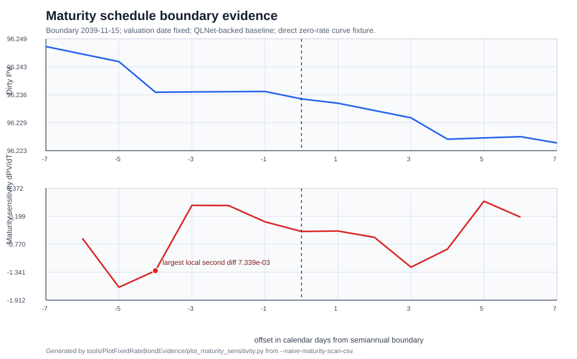

# Can Chebyshev Models Clone a Fixed-Rate Bond Pricer?

This case study asks a practical question: can Chebyshev interpolation replace
a fixed-rate bond pricing function while preserving price and risk
sensitivities?

The short answer is: not by blindly fitting one global high-dimensional tensor.
For the supported product family, the first accurate clone resolves the bond
cashflows first, keeps coupon and notional algebraic, and uses Chebyshev
kernels only for the smooth discount-factor pieces. This page focuses on
correctness and reproducibility first, then reports the first BenchmarkDotNet
speed evidence for scalar price, batch price, and all-pillar risk.

The example is public and reproducible. It uses QLNet as the reference pricer,
a pinned Federal Reserve nominal-yield-curve fixture, and a regular fixed-rate
bullet bond. It is a ChebyshevSharp demonstration, not a general fixed-income
library.

## What the example prices

The runnable harness lives in `examples/FixedRateBondSurrogate`.

| Item | Choice |
| --- | --- |
| Reference pricer | QLNet `FixedRateBond` with `DiscountingBondEngine` |
| Curve fixture | Federal Reserve fitted nominal yield curve, 2026-05-15 |
| Curve grid | valuation-date anchor plus 60 semiannual zero-rate pillars |
| Curve convention | Actual/365 Fixed timing, continuous compounding, linear zero-rate interpolation |
| Bond family | regular fixed-rate bullet bond |
| Coupon schedule | semiannual |
| Coupon day count | 30/360 USA |
| Calendar | U.S. Government Bond |
| Business-day rule | Modified Following |
| Settlement assumption | valuation date equals effective date |
| Excluded features | amortization, callability, ex-coupon logic, stubs, arbitrary settlement dates |

Run the baseline:

```bash
dotnet run --project examples/FixedRateBondSurrogate/FixedRateBondSurrogate.csproj
```

The default request is a 30-year 4.5% coupon bullet bond. It prices to dirty
price `89.26423408` per 100 notional against the upward-sloping fixture. That
is economically plausible because the fitted 30-year zero yield is about
5.33%, above the coupon.

## The clone target

The public wrapper is deliberately large:

```text
curve bumps[60], coupon, maturity -> dirty price per 100 notional
```

Let

- $x \in \mathbb{R}^{60}$ be the zero-rate bump vector in basis points,
- $c$ be the annual coupon rate,
- $T$ be the maturity coordinate, and
- $Q(x,c,T)$ be dirty price per 100 notional.

The case study keeps all 60 curve coordinates at the wrapper boundary. A model
may reduce dimensions internally, but it is not considered a faithful clone if
it only accepts a few selected pillars or a few curve factors. Notional is not a
Chebyshev coordinate because dirty price per 100 scales linearly:

$$
\mathrm{CashValue}(x,c,T,N) = \frac{N}{100} Q(x,c,T).
$$

## How price and risk are checked

A price-only comparison is not enough for a risk use case. The harness checks
held-out price, curve sensitivities, maturity sensitivity, coupon sensitivity,
and cross sensitivities.

| Metric | Formula | What it checks |
| --- | --- | --- |
| PV error | $\lvert Q_{\mathrm{model}} - Q_{\mathrm{ref}}\rvert$ or relative error | Whether the price clone is accurate. |
| DV01 vector | $\partial Q / \partial x_i$ for all 60 pillars | Whether rate exposure is assigned to the right curve pillars. |
| Maturity sensitivity | $\partial Q / \partial T$, measured by finite differences | Whether the model follows local price changes as maturity moves. |
| Coupon derivative | $\partial Q / \partial c$ | Whether coupon exposure is correct. |
| Rate-coupon cross sensitivity | $\partial^2 Q / (\partial x_i\,\partial c)$ | Whether coupon exposure changes correctly when rates move. |
| Rate-maturity cross sensitivity | $\partial^2 Q / (\partial x_i\,\partial T)$ | Whether rate exposure changes correctly when maturity moves. |
| Coupon-maturity cross sensitivity | $\partial^2 Q / (\partial c\,\partial T)$ | Whether annuity-like coupon exposure changes correctly when maturity moves. |
| Rate-rate cross sensitivity | $\partial^2 Q / (\partial x_i\,\partial x_j)$ | Whether the discount-factor curvature is localized and numerically stable. |

Relative errors are useful when the reference sensitivity is material. When the
reference derivative is close to zero, the final candidate is judged mainly by
absolute PV, all-pillar DV01, and cross-sensitivity errors.

The word "cross" means a mixed second derivative. For example, the
coupon-maturity cross sensitivity is not a separate price measure; it is the
finite-difference estimate of $\partial^2 Q / (\partial c\,\partial T)$. The
reported table entry is the model's error in that cross sensitivity.

## How speed is treated in this article

The main trial tables are accuracy-first because a fast but wrong risk clone is
not useful. The final section adds a BenchmarkDotNet speed check with managed
allocation columns. Those numbers are still diagnostic, but they are stronger
than a hand-written stopwatch loop.

The speed comparison includes three baselines:

1. QLNet as the trusted reference-pricer path.
2. The schedule-resolved Chebyshev kernel clone.
3. An exact cached cashflow control for one fixed schedule.

The third baseline is important. For this direct-zero fixed-rate bond, once the
schedule is known, exact cashflow summation is very cheap. Chebyshev should not
be judged only against a high-overhead reference adapter if a specialized exact
cashflow pricer is available.

## The baseline formula

For a resolved fixed-rate bond schedule, the reference price is a discounted
cashflow sum:

$$
Q_{\mathrm{ref}}(x,c,T)
  = \frac{100}{N_0}
    \sum_{k \in \mathcal{C}(T)}
    \mathrm{CF}_k(c,T)\,D_x(t_k).
$$

Here $\mathcal{C}(T)$ is the future cashflow schedule generated by the
supported conventions, $t_k$ is the payment time, $N_0$ is the schedule's
base notional, and $D_x(t_k)$ is the bumped discount factor. The difficult
part is not the cashflow sum itself. The difficult part is that changing
$T$ can change $\mathcal{C}(T)$.

The direct zero curve uses continuous compounding and linear zero-rate
interpolation. If a payment time $t_k$ lies between adjacent curve pillars
$t_j$ and $t_{j+1}$, then

$$
z_x(t_k)
  = (1-w_k)\left(z_j + 10^{-4}x_j\right)
    + w_k\left(z_{j+1} + 10^{-4}x_{j+1}\right),
$$

$$
D_x(t_k)=\exp\left(-t_k z_x(t_k)\right).
$$

This local interpolation fact is the key to the final method: each individual
discount factor depends on at most two curve-bump coordinates.

## Why a dense tensor is impossible

A full Chebyshev tensor over 62 scalar coordinates is not a realistic starting
point. With only three nodes per coordinate, the source pricer would need

$$
3^{62}
  = 381{,}520{,}424{,}476{,}945{,}831{,}628{,}649{,}898{,}809
$$

function evaluations. The rest of the case study therefore asks whether common
compressed Chebyshev models can preserve the full wrapper without building the
dense grid.

## Trial map

| Trial | Model idea | Why try it? | Result |
| --- | --- | --- | --- |
| Global Tensor Train and Slider | Fit $Q(x,c,T)$ directly. | This is the most natural first attempt for a high-dimensional function. | Fails on PV and risk sensitivities. |
| Stronger global models, grouped Slider, curve factors, buckets | Add common dimensional compression and maturity routing. | Maybe the first model was too weak or used the wrong coordinates. | Improves some PV metrics but still fails as a full 60-pillar clone. |
| Analytic coupon decomposition | Use fixed-rate bond linearity in $c$. | Coupon should not be a nonlinear tensor axis if cashflows are fixed. | Identity is exact, but maturity remains hard. |
| Schedule and automatic split points | Split maturity into smoother pieces. | Chebyshev methods work best on smooth pieces. | Schedule-aware splits help; automatic split detection alone is not enough. |
| Active-pillar and fixed-trade controls | Remove inactive post-maturity pillars or fix the trade. | Risk systems often price known trades under curve scenarios. | Fixed-trade curve-only TT works well; parametric new-bond clone still needs more structure. |
| Schedule-resolved cashflow kernels | Resolve cashflows first and approximate only local discount factors. | The bond formula already decomposes into low-dimensional smooth kernels. | Accurate for the supported family; scalar speedup is useful, and all-pillar risk speedup is large. |

## Trial 1: one global model

The naive experiment directly fits the full wrapper:

$$
\widehat{Q}(x,c,T) \approx Q_{\mathrm{ref}}(x,c,T).
$$

Run it:

```bash
dotnet run --project examples/FixedRateBondSurrogate/FixedRateBondSurrogate.csproj -- --naive-surrogate-discovery
```

`ChebyshevTT` represents the sampled tensor through Tensor Train cores:

$$
\widehat{Q}_{\mathrm{TT}}(u_1,\ldots,u_{62})
  = G_1(u_1)G_2(u_2)\cdots G_{62}(u_{62}),
$$

where $u=(x_1,\ldots,x_{60},c,T)$. This can capture cross-variable structure
when the required ranks remain moderate, but the rank is an empirical property
of the sampled function. It must be validated on held-out points.

`ChebyshevSlider` uses an anchored additive decomposition around a pivot point
$p$:

$$
\widehat{Q}_{\mathrm{slider}}(u)
  = Q(p)
    + \sum_g \left[
        Q(u_g,p_{-g}) - Q(p)
      \right].
$$

This is cheap, but if coupon and maturity are in separate groups then
$\partial^2 \widehat{Q}_{\mathrm{slider}} / (\partial c\,\partial T)=0$ by
construction. That structural limitation explains why some cross sensitivities
fail even when each one-dimensional slide is well resolved.

| Model | Build evals | Max PV relative error | Max maturity-sensitivity relative error | Max rel. error in $\partial^2 Q/(\partial c\,\partial T)$ |
| --- | ---: | ---: | ---: | ---: |
| TensorTrain | 5,274 | 17.72% | 461.43% | 49.10% |
| Slider | 186 | 92.64% | 154.35% | 100.00% |

The structural sanity checks pass: a 10-year bond has zero direct sensitivity
to the unsupported 30-year zero-rate pillar in the reference and in the
surrogate probes. The failure is therefore not a simple post-maturity exposure
bug. One global smooth object is trying to learn schedule-sensitive behavior
and cross sensitivities that it does not resolve.

## Why maturity is the hard coordinate

Coupon is smooth for this supported product. Maturity is different because it
can regenerate the schedule. A one-day change can alter the number of future
cashflows, the final accrual period, or the business-day-adjusted payment date.

The harness scans one-day windows around semiannual maturity regions. Dirty PV
can look visually mild while the finite-difference slope jumps:



Representative spike evidence:

| Maturity date | Future cashflows | Second difference | Left slope/year | Right slope/year |
| --- | ---: | ---: | ---: | ---: |
| 2039-11-11 | 28 | `7.339039E-003` | `-2.650493E+000` | `2.825619E-002` |
| 2040-11-10 | 30 | `7.191154E-003` | `-2.605554E+000` | `1.921722E-002` |
| 2038-05-15 | 25 | `6.116018E-003` | `-1.953303E+000` | `2.790432E-001` |

This is the practical meaning of piecewise smoothness here. Price may remain
continuous enough to look benign, but slope and cross sensitivities are poor
targets for one global polynomial surrogate.

## Trial 2: common compression and buckets

The next trial keeps the same public wrapper but tries common modelling fixes:
a stronger global TT, grouped Slider partitions, low-dimensional curve factors,
and maturity buckets.

```bash
dotnet run --project examples/FixedRateBondSurrogate/FixedRateBondSurrogate.csproj -- --structured-alternatives
```

The curve-factor model replaces arbitrary pillar bumps with a lower-dimensional
factor vector $a$:

$$
x \approx B a,
$$

where the basis $B$ contains level, slope, and curvature-like shapes. The
model then fits

$$
\widehat{Q}_{\mathrm{factor}}(a,c,T)
  \approx Q_{\mathrm{ref}}(Ba,c,T).
$$

The bucketed version routes maturity into a local interval $I_b$:

$$
\widehat{Q}_{\mathrm{bucket}}(x,c,T)
  = \widehat{Q}_b(x,c,T),
  \qquad T \in I_b.
$$

| Model | Max PV relative error on arbitrary 60-pillar bumps | Max maturity-sensitivity relative error | Max rel. error in $\partial^2 Q/(\partial c\,\partial T)$ | Max PV relative error on factor-aligned scenarios |
| --- | ---: | ---: | ---: | ---: |
| Stronger global TT | 12.36% | 256.28% | 80.99% | 11.85% |
| Grouped Slider | 8.48% | 327.65% | 75.20% | 5.85% |
| Curve-factor tensor | 4.70% | 90.42% | 59.04% | 0.59% |
| Semiannual bucketed curve-factor tensor | 4.73% | 87.72% | 56.94% | 0.58% |

The factor tensor is useful when scenarios are generated from the same factor
space. It is not a faithful clone of arbitrary 60-pillar bump vectors. This is
an important distinction: factor compression can be a good workflow when the
input contract is factor scenarios, but it is not a drop-in replacement for a
function whose public input is every curve pillar.

## Trial 3: coupon is algebraic

For a regular fixed-rate bullet bond with a fixed schedule, coupon cashflows are
linear in the coupon rate:

$$
\mathrm{CF}_k(c,T) = R_k(T) + c A_k(T),
$$

so

$$
Q(x,c,T)
  = P(x,T) + c A(x,T),
$$

where

$$
P(x,T) = \frac{100}{N_0}\sum_k R_k(T)D_x(t_k),
\qquad
A(x,T) = \frac{100}{N_0}\sum_k A_k(T)D_x(t_k).
$$

Run the check:

```bash
dotnet run --project examples/FixedRateBondSurrogate/FixedRateBondSurrogate.csproj -- --analytic-coupon-decomposition
```

The identity holds to numerical roundoff: max absolute error is
`8.526513E-014` across the validation bank. It also gives a useful
cross-sensitivity identity:

$$
\frac{\partial^2 Q}{\partial x_i\,\partial c}
  = \frac{\partial A}{\partial x_i}.
$$

This is mathematically useful because it says coupon does not need to be learned
as a hard nonlinear Chebyshev axis. But it does not solve maturity. A global
decomposed TT still reports `456.94%` max maturity-sensitivity relative error
in the benchmark.

## Trial 4: schedule splits and automatic split detection

Since Chebyshev interpolation performs best on smooth intervals, the next trial
tests whether maturity should be routed into smoother pieces:

$$
\widehat{Q}(x,c,T)
  = \widehat{Q}_b(x,c,T),
  \qquad T \in [T_b,T_{b+1}).
$$

The split candidates come from two ideas:

1. **Schedule-aware split points:** use known semiannual schedule regions and
   observed cashflow-count changes.
2. **Automatic split detection:** scan maturity slices for large local second
   differences and introduce candidate knots.

Run the benchmark:

```bash
dotnet run --project examples/FixedRateBondSurrogate/FixedRateBondSurrogate.csproj -- --maturity-special-points
```

| Model | Max PV relative error | Max maturity-sensitivity relative error | Max rel. error in $\partial^2 Q/(\partial c\,\partial T)$ |
| --- | ---: | ---: | ---: |
| Global decomposed curve-factor tensor | 5.12% | 142.62% | 74.94% |
| Semiannual uniform bucketed tensor | 4.70% | 96.44% | 55.52% |
| Schedule-aware special-point tensor | 4.73% | 89.21% | 48.75% |
| Automatic-detector special-point tensor | 4.73% | 274.41% | 59.50% |
| Hybrid special-point tensor | 4.73% | 399.72% | 48.75% |

Schedule-aware routing improves derivative-style metrics versus a uniform
bucket control, but it is not a finished clone. The automatic detector result
is especially important: adding more split points is not automatically better.
For this bond problem, split detection needs schedule context and held-out risk
validation.

## Trial 5: active pillars and fixed trades

The next diagnostic asks whether the remaining error comes from modelling too
many irrelevant curve coordinates. For a maturity $T$, pillars far beyond the
last relevant cashflow should not affect price under this direct-zero setup.

The active-support oracle confirms this: removing post-maturity-neighborhood
bumps produces zero PV error on the validation bank. The number of active curve
dimensions ranges from 5 to 60, depending on maturity.

A local 10-year active-pillar TT improves price but still fails maturity
sensitivity:

| Candidate | Internal dims | Build evals | Max PV relative error | Max 10Y DV01 relative error | Max maturity-sensitivity relative error | Max rel. error in $\partial^2 Q/(\partial c\,\partial T)$ |
| --- | ---: | ---: | ---: | ---: | ---: | ---: |
| 10Y active-pillar TT | 23 | 2,014 | 1.53% | 9.83% | 132.88% | 120.33% |
| Narrow 10Y active-pillar TT | 23 | 3,566 | 0.48% | 1.03% | 161.90% | 10.98% |

The fixed-trade control is the clearest positive result from this family. If
coupon and maturity are fixed and only the active curve pillars vary, a
curve-only TT uses 21 internal dimensions and 837 build evaluations, with max
PV absolute error `1.796590E-004` and effectively zero displayed PV/DV01
relative error. That is a good recipe for a known trade under repeated curve
scenarios. It is not the same problem as a parametric new-bond surface over
coupon and maturity.

## First accurate clone: resolve cashflows first

The successful method changes the modelling premise. It keeps the same
62-coordinate public wrapper, but it stops asking a global TT to rediscover the
bond pricing formula.

The implementation is
`examples/FixedRateBondSurrogate/ScheduleResolvedCashflowChebyshevBondPricer.cs`.
It does three things:

1. Resolve the maturity coordinate to the supported bond schedule and cache the
   future cashflow template.
2. Keep coupon and notional algebraic in the cashflow amount.
3. Use local Chebyshev kernels only for the smooth discount-factor pieces.

For each payment $k$, build a one- or two-dimensional Chebyshev kernel
$K_k$ for the discount factor:

$$
K_k(x_j,x_{j+1}) \approx D_x(t_k).
$$

Then price by recombining the resolved cashflows:

$$
\widehat{Q}(x,c,T)
  = \frac{100}{N_0}
    \sum_{k \in \mathcal{C}(T)}
    \left(R_k(T) + c A_k(T)\right)
    K_k(x_j,x_{j+1}).
$$

This formula explains why the method captures the important cross sensitivities.
For example,

$$
\frac{\partial^2 \widehat{Q}}{\partial x_j\,\partial c}
  = \frac{100}{N_0}
    \sum_{k \in \mathcal{C}(T)}
    A_k(T)\frac{\partial K_k}{\partial x_j}.
$$

Maturity is no longer treated as a single globally smooth polynomial axis. It
is a schedule-routing input that chooses the cashflow template. Chebyshev
interpolation is used only after the smooth local discount-kernel problem has
been isolated.

Run the final evidence mode:

```bash
dotnet run --project examples/FixedRateBondSurrogate/FixedRateBondSurrogate.csproj -- --accuracy-recipe-search
```

| Result | Value |
| --- | ---: |
| Public wrapper dimension | 62 |
| Max internal kernel dimension | 2 |
| Validation points | 99 |
| Build evaluations | 39,699 |
| Measured scalar evaluation speedup, current harness | 9.1x |
| BenchmarkDotNet scalar speedup vs QLNet | 7.6x |
| BenchmarkDotNet all-pillar risk speedup vs finite-difference QLNet | 850.4x |
| BenchmarkDotNet batch-32 scalar speedup vs QLNet | 7.1x |
| Max PV absolute error | `1.348184E-010` |
| Max all-pillar DV01 absolute error | `4.263256E-010` |
| Max 10Y rate-coupon cross-sensitivity absolute error | `2.842171E-006` |
| Max 10Y rate-maturity cross-sensitivity absolute error | `1.112253E-008` |
| Max 10Y-10.5Y rate-rate cross-sensitivity absolute error | `3.197442E-006` |
| Non-100 notional dirty-price max absolute error | `4.243361E-011` |

This is the first method in the case study that behaves like a practical clone
for the supported family. It accepts the full request-level wrapper, preserves
schedule-sensitive maturity behavior by resolving cashflows, captures
coupon-rate cross sensitivities through the cashflow formula, rejects out-of-domain
curve bumps instead of silently clamping, and avoids modelling inactive
post-maturity curve pillars.

The speed result is mixed but useful. Scalar price is several times faster than
the QLNet reference path, and the all-pillar risk snapshot is hundreds of times
faster than finite-difference QLNet because it computes the curve gradient and
rate-coupon mixed terms analytically in one pass. However, the exact cached
cashflow control prices a fixed resolved schedule faster than the Chebyshev
kernel. That means this case study supports a formula-aware Chebyshev clone for
public demonstration and fast risk snapshots, while a production scalar
fixed-bond pricer should still compare against an exact cached cashflow engine.

## Why this method is accurate

The proof is a decomposition argument under the stated conventions.

First, the supported product's dirty price is a sum of future discounted
cashflows. Second, each cashflow amount is affine in coupon:

$$
\mathrm{CF}_k(c,T)=R_k(T)+cA_k(T).
$$

Third, under linear zero-rate interpolation, each discount factor depends on at
most two adjacent curve-bump coordinates. Therefore every term in the price sum
is low-dimensional once the schedule has been resolved:

$$
\mathrm{CF}_k(c,T)D_x(t_k)
  =
  \left(R_k(T)+cA_k(T)\right)
  D_k(x_j,x_{j+1}).
$$

The final model approximates only $D_k$, the smooth exponential discount
kernel. It does not approximate the whole discontinuously routed schedule with
one polynomial. That is why the method can preserve the 62-coordinate public
interface while keeping the largest internal Chebyshev problem two-dimensional.

The tradeoff is equally important: this is a formula-aware surrogate for a
supported regular fixed-rate bullet family. It is not a blind black-box
replacement for arbitrary bond products.

## Reproduce the evidence

Run the commands in this order:

```bash
dotnet run --project examples/FixedRateBondSurrogate/FixedRateBondSurrogate.csproj
dotnet run --project examples/FixedRateBondSurrogate/FixedRateBondSurrogate.csproj -- --naive-surrogate-discovery
dotnet run --project examples/FixedRateBondSurrogate/FixedRateBondSurrogate.csproj -- --structured-alternatives
dotnet run --project examples/FixedRateBondSurrogate/FixedRateBondSurrogate.csproj -- --analytic-coupon-decomposition
dotnet run --project examples/FixedRateBondSurrogate/FixedRateBondSurrogate.csproj -- --maturity-special-points
dotnet run --project examples/FixedRateBondSurrogate/FixedRateBondSurrogate.csproj -- --schedule-aware-router
dotnet run --project examples/FixedRateBondSurrogate/FixedRateBondSurrogate.csproj -- --accuracy-recipe-search
```

Regenerate the maturity-sensitivity figure:

```bash
python tools/PlotFixedRateBondEvidence/plot_maturity_sensitivity.py
```

Run the fixed-rate bond test slice:

```bash
dotnet test tests/ChebyshevSharp.Tests/ChebyshevSharp.Tests.csproj \
  --framework net10.0 \
  --configuration Release \
  --filter "FullyQualifiedName~FixedRateBond" \
  --verbosity minimal
```

Build the documentation:

```bash
docfx docs/docfx.json
```

## Practical lessons

Use the case study as a modelling workflow:

1. Start with a trusted reference pricer and a pinned public data fixture.
2. Define the public surrogate input contract before reducing dimensions
   internally.
3. Build the naive global surrogate first to expose failure modes.
4. Validate price and risk quantities, not only interpolation error estimates.
5. Add structural checks a risk user would expect, such as zero direct DV01 to
   unsupported post-maturity pillars.
6. Use factor compression only when the input contract is factor scenarios.
7. Treat maturity as schedule-sensitive for parametric bond surfaces.
8. Use formula-aware decomposition when the product payoff structure gives one.

## Sources

Core numerical, finance, fixed-income, and data references are listed in
[Citations](citations.md). The most relevant entries for this page are
Chebyshev interpolation, Tensor Train algorithms, sensitivity analysis,
piecewise smoothness, QLNet/QuantLib and OpenGamma fixed-income references, and
Federal Reserve public yield-curve data.
