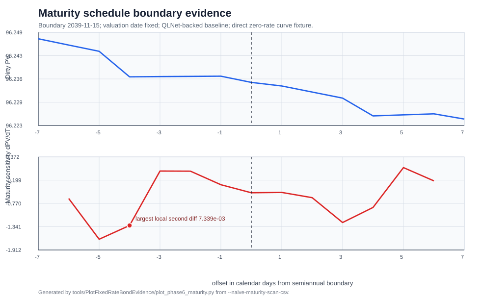

# Phase 6 Report: Naive Dense-Baseline Surrogate Discovery

## Objective

Phase 6 starts from the viewpoint of a new user trying to accelerate a
fixed-rate bond pricer with Chebyshev tensors. It does not assume the
previous modelling hypotheses are correct. The phase asks what happens if the
QLNet-backed bond price is treated naively as one full-PV function of curve
bumps, coupon, and maturity.

This phase intentionally does **not** use analytic coupon decomposition,
maturity buckets, adaptive splitting, or portfolio-specific models. Those
belong to later phases after the failure modes are measured.

## Baseline and Input Counting

The baseline remains the QLNet-backed reference pricer from Phase 5. The dense
fixture contains 60 semiannual zero-rate market points from 0.5Y to 30Y, plus a
valuation-date anchor used internally by the QLNet zero curve.

Conceptually, the product input blocks are:

```text
curve, coupon, maturity, notional
```

For Chebyshev interpolation, however, each scalar curve bump is one dimension.
Holding notional fixed at `100.0`, the naive scalar surrogate is:

```text
(curve bumps[60], coupon, maturity) -> dirty PV
```

That is a 62-dimensional function before adding notional. Including notional
would make it 63-dimensional, but Phase 5 already verifies notional scaling is
linear.

## Dense Tensor Infeasibility

Even very small dense Chebyshev grids are infeasible:

| Nodes per dimension | Dense node count |
| ---: | ---: |
| `3^62` | `381,520,424,476,945,831,628,649,898,809` |
| `5^62` | `21,684,043,449,710,088,680,149,056,017,398,834,228,515,625` |

So the phase does not attempt a dense full tensor. It uses TensorTrain and
Slider as feasible full-input naive probes.

## Full-Input Naive Probe

The probe keeps the full 62-dimensional input wrapper:

```text
f(b_6M, b_1Y, ..., b_30Y, c, T) = dirty PV
```

where the 60 rate-bump coordinates correspond to the dense semiannual curve
pillars, rate bumps are in basis points, `c` is coupon, and `T` is maturity in
years from the valuation date. The experiment may use a low-order TT or a
partitioned Slider internally, but the callable model input is always the full
62-coordinate vector.

Domain:

| Dimension | Range |
| --- | --- |
| 60 semiannual zero-rate bumps, 6M to 30Y | `[-150, 150]` bp |
| coupon | `[0.00, 0.12]` |
| maturity | `[2.0, 30.0]` years |

Both models use the same QLNet baseline, validation points, and
finite-difference metrics. The Slider partition is deliberately naive but still
62-dimensional:

```text
[[6M], [1Y], ..., [30Y], [coupon], [maturity]]
```

This tests whether a computationally cheap global Slider loses the interactions
needed by a faithful bond-pricer clone.

## Compared Quantities

The report compares PV and finite-difference sensitivities:

```text
PV
dPV / dr_i
dPV / dc
dPV / dT
d2PV / dr_i dc
d2PV / dr_i dT
d2PV / dc dT
```

Terminology used in this report:

| Quantity | Report label | Meaning |
| --- | --- | --- |
| `dPV / dr_i` | zero-pillar DV01 | Direct zero-rate pillar sensitivity per 1 bp coordinate move. |
| `dPV / dc` | coupon derivative | PV sensitivity to the annual coupon-rate coordinate. |
| `dPV / dT` | maturity sensitivity | PV sensitivity to contractual maturity with valuation date fixed. |
| `d2PV / dr_i dc` | rate-coupon mixed | Cross sensitivity between one zero-rate pillar and coupon. |
| `d2PV / dr_i dT` | rate-maturity mixed | Cross sensitivity between one zero-rate pillar and maturity. |
| `d2PV / dc dT` | coupon-maturity mixed | Cross sensitivity between coupon and maturity. |
| `d2PV / dr_i dr_j` | rate-rate mixed | Curve-node cross sensitivity. |

Rate coordinates are basis-point bump coordinates, so the reported
zero-pillar DV01 is the price sensitivity to a one-basis-point shift in one
direct zero-rate pillar. OpenGamma/Strata uses related language for bucketed
PV01, bucketed delta, rate sensitivities, and key-rate duration, and separates
calibrated-curve-node PV01 from market-quote PV01. This phase uses the former
kind of direct-zero node sensitivity, not a bootstrapped market-quote DV01.

The quantity previously called "maturity slope" is now labelled **maturity
sensitivity**:

```text
dPV / dT
```

It is the finite-difference sensitivity of dirty PV to the contractual maturity
parameter with the valuation date fixed and the cashflow schedule regenerated.
It is not theta, carry, or roll-down, because time is not advanced. Maturity
uses a seven-day finite-difference step. Relative errors use a small floor;
extremely large relative errors often mean the baseline quantity is near zero,
so max absolute error must be read alongside max relative error.

Rate-rate mixed terms are expected to be zero only when the two bumped curve
nodes have no interpolation support on the same remaining cashflow discount
factor. In this semiannual fixture, the measured `20Y-30Y` mixed check is
structurally zero at the validation points. That should not be generalized to
arbitrary curve grids, interpolators, or cashflow dates.

## Naive Model Configuration

The TensorTrain probe is a valid full-input TT-Cross build over all 62 user
coordinates, using `nNodes = 3`, `maxRank = 6`, and the canonical dimension
order. It intentionally does not use `WithAutoOrder()`, Sobol pruning, maturity
splitting, or analytic coupon decomposition; those are later modelling choices,
not the naive global baseline.

The Slider probe is also a valid 62D `ChebyshevSlider`, but its partition is
the singleton decomposition:

```text
[[6M], [1Y], ..., [30Y], [coupon], [maturity]]
```

With three Chebyshev nodes per singleton slide, the build cost is only
`62 * 3 = 186` function evaluations. That low cost is exactly the point of the
contrast case. It is an anchored additive approximation, so cross-group mixed
derivatives are zero by construction and cross-variable interactions are not
represented unless interacting variables are grouped in the same slide.

## Results

Command:

```bash
dotnet run --project examples/FixedRateBondSurrogate/FixedRateBondSurrogate.csproj -- --naive-surrogate-discovery
```

Measured on 12 deterministic validation points:

| Model | Build evals | Max PV rel. error | Max maturity-sensitivity rel. error | Max coupon-maturity mixed rel. error |
| --- | ---: | ---: | ---: | ---: |
| TensorTrain | 5274 | 17.72% | 461.43% | 49.10% |
| Slider | 186 | 92.64% | 154.35% | 100.00% |

Selected TensorTrain errors:

| Metric | Max abs. error | Max rel. error | Worst point |
| --- | ---: | ---: | --- |
| PV | `1.123330E+001` | 17.72% | `n6` |
| coupon derivative | `1.721368E+002` | 17.57% | `n8` |
| 10Y zero-pillar DV01 | `6.001897E-002` | very large, baseline near zero at worst point | `n12` |
| 30Y zero-pillar DV01 | `6.056521E-002` | 100.00% | `n4` |
| maturity sensitivity | `3.880240E+000` | 461.43% | `n10` |
| 10Y rate-maturity mixed | `1.311026E-001` | very large, baseline near zero at worst point | `n11` |
| 20Y-30Y rate-rate mixed | `0.000000E+000` | 0.00% | `n12` |
| coupon-maturity mixed | `2.547448E+001` | 49.10% | `n6` |

Selected Slider errors:

| Metric | Max abs. error | Max rel. error | Worst point |
| --- | ---: | ---: | --- |
| PV | `6.865510E+001` | 92.64% | `n5` |
| coupon derivative | `9.010148E+002` | 423.05% | `n5` |
| maturity sensitivity | `7.757617E+000` | 154.35% | `n5` |
| 10Y rate-coupon mixed | `3.621014E-002` | 100.00% | `n6` |
| 10Y rate-maturity mixed | `1.311016E-001` | 100.00% | `n11` |
| 20Y-30Y rate-rate mixed | `1.421085E-014` | 0.01% | `n6` |
| coupon-maturity mixed | `9.184798E+001` | 100.00% | `n5` |

## Structural Sanity Checks

The baseline and surrogates are also tested on support checks that should be
obvious to a risk manager before looking at interpolation error metrics.

| Check | Baseline | TensorTrain | Slider | Interpretation |
| --- | ---: | ---: | ---: | --- |
| 10Y bond / 30Y zero-pillar DV01 | `0.000000E+000` | `0.000000E+000` | `-7.105427E-015` | A 30Y direct-zero bump has no support for a bond maturing at the 10Y pillar. |
| 10Y bond / 20Y-30Y rate-rate mixed | `0.000000E+000` | `0.000000E+000` | `0.000000E+000` | Unsupported post-maturity rate-rate cross sensitivity is zero. |

These checks pass. The naive global failure is therefore not a blanket
"surrogates ignore maturity" problem. It is more specific: the low-node global
TT and singleton Slider are weak on PV, maturity sensitivity, coupon
derivative, DV01 at difficult validation points, and cross terms involving
coupon or maturity.

## Additional Sanity Checks to Keep

Future phases should keep adding cheap structural checks before tuning the
surrogate:

- coupon monotonicity: for positive remaining cashflows, dirty PV should
  increase when coupon increases;
- notional scaling: doubling notional should double PV and first-order
  sensitivities;
- rate direction: a positive parallel zero-rate bump should not increase the
  price of a positive-cashflow fixed-rate bond;
- unsupported tenor checks: any zero-rate pillar with no interpolation support
  on remaining cashflows should have zero direct-zero DV01;
- active support checks: active nearby curve nodes may have nonzero DV01 and,
  under some interpolators or cashflow dates, nonzero rate-rate cross terms;
- finite-difference stability: PV, DV01, and cross-term conclusions should be
  checked against at least one smaller and one larger bump size;
- boundary checks: coupons and maturities near the domain limits should not be
  silently clamped or interpreted as evidence for interior accuracy.

## Maturity Smoothness Evidence

The baseline maturity scan checks one-day left and right slopes around
semiannual schedule-boundary candidates from 2Y to 30Y. The largest observed
second-difference candidates are:

| Maturity date | Offset | Cashflows | Second difference | Left slope/year | Right slope/year |
| --- | ---: | ---: | ---: | ---: | ---: |
| 2039-11-11 | -4d | 28 | `7.339039E-003` | `-2.650493E+000` | `2.825619E-002` |
| 2040-11-10 | -5d | 30 | `7.191154E-003` | `-2.605554E+000` | `1.921722E-002` |
| 2041-11-09 | -6d | 32 | `6.993055E-003` | `-2.536190E+000` | `1.627477E-002` |
| 2035-11-10 | -5d | 20 | `6.654704E-003` | `-2.405472E+000` | `2.349520E-002` |
| 2038-05-15 | 0d | 25 | `6.116018E-003` | `-1.953303E+000` | `2.790432E-001` |

This supports the working hypothesis that maturity is not globally smooth in
the same way as coupon or small curve bumps. Changing maturity changes the
cashflow schedule and can flip local one-day slopes around schedule boundaries.
The largest spikes can occur a few calendar days before the nominal semiannual
date because the U.S. Government Bond calendar and Modified Following
adjustment move actual payment dates.

The following generated figure focuses on the largest observed local
second-difference window, around the 2039-11-15 semiannual boundary. Dirty PV
looks visually mild, while the finite-difference maturity sensitivity moves
abruptly over adjacent days.



The source data is committed as
[phase-6-maturity-scan.csv](../data/phase-6-maturity-scan.csv). Regenerate the
CSV and SVG with:

```bash
python tools/PlotFixedRateBondEvidence/plot_phase6_maturity.py
```

## Interpretation

The naive dense tensor is not a viable baseline because the scalar dimension
count is too high. The full-input low-node TensorTrain is computationally
feasible but already weak on this discovery set: PV reaches 17.72% relative
error, and maturity sensitivity and mixed terms are much worse. The full-input
singleton Slider is very cheap to build, but the approximation is too weak for
the clone objective because it discards the interactions between curve, coupon,
and maturity.

This is enough evidence to justify testing more structured modelling next, but
not enough to pick the final approach. The next phase should compare fixes
against these measured failure modes rather than assume a solution in advance.

## References

- OpenGamma Strata bucketed PV01 article: <https://opengamma.com/strata-and-multi-curve-calibration-and-bucketed-pv01/>
- OpenGamma Strata PV01 API docs: <https://strata.opengamma.io/apidocs/com/opengamma/strata/measure/dsf/DsfTradeCalculations.html>
- QuantLib Guide vanilla bonds: <https://www.quantlibguide.com/Vanilla%20bonds.html>
